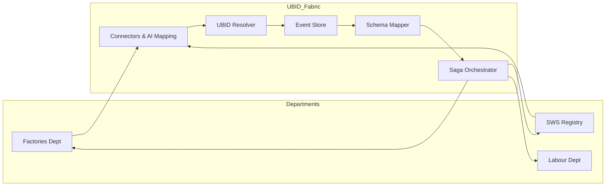

# 🏛️ UBID Fabric: Technical Architecture

The UBID Fabric is built on a **Deterministic Interoperability Model**. Unlike traditional ESBs (Enterprise Service Buses), UBID Fabric treats data integration as a causal sequence of events.

---

## 🏗️ The 5-Layer Model

### 1. L1: Ingestion Layer (Connectors)
*   **Purpose:** Bridge heterogeneous department APIs.
*   **Implementation:** Dynamic `Connector` registry. Supports Webhooks (Push) and REST polling (Pull).
*   **AI Integration:** Uses Gemini/Ollama to generate field mappings on-the-fly, reducing integration time from weeks to minutes.

### 2. L2: Resolution Layer (UBID Resolver)
*   **Purpose:** Solve the "Identity Crisis".
*   **Implementation:** A deterministic registry that maps `SystemID` (e.g., Factories-123) to a `UBID` (e.g., UBID-KA-2024-001).
*   **Mechanism:** Uses fuzzy matching and strict cross-referencing tables to prevent duplicate entity creation.

### 3. L3: Persistence Layer (Canonical Event Store)
*   **Purpose:** Immutability and Auditability.
*   **Implementation:** PostgreSQL-backed event log. Every change is stored as a `CanonicalEvent`.
*   **Causality:** Uses **Lamport Clocks** to ensure that events are ordered correctly across distributed systems.

### 4. L4: Translation Layer (Schema Mapper)
*   **Purpose:** Canonicalization.
*   **Implementation:** A transformation engine that applies field mappings defined in the Ingestion layer to produce a standard "Golden Record".
*   **Conflict Resolution:** Handles attribute-level conflicts (e.g., Dept A says address is X, Dept B says address is Y) using source priority and domain ownership rules.

### 5. L5: Propagation Layer (Saga Orchestrator)
*   **Purpose:** Consistency.
*   **Implementation:** Distributed Sagas. When a record converges in the Fabric, the orchestrator identifies all "subscribed" departments and pushes the update to them.
*   **Resilience:** Features a built-in **Dead Letter Queue (DLQ)** for handling downstream system outages.

---

## 📊 Data Flow Diagram (Conceptual)

---

## 🛡️ Governance & Traceability
Every transaction in the Fabric creates a node in the **Evidence Graph**. This allows auditors to "time-travel" through a business record's history, seeing exactly who changed what, when, and with what evidence.
