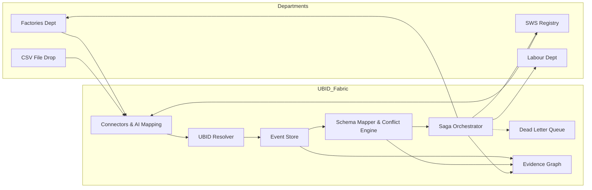

# 🏛️ UBID Fabric: Technical Architecture (v0.2)

The UBID Fabric is built on a **Deterministic Interoperability Model**. Unlike traditional ESBs (Enterprise Service Buses), UBID Fabric treats data integration as a causal sequence of events.

---

## 🏗️ The 5-Layer Model

### 1. L1: Ingestion Layer (Connectors)
*   **Purpose:** Bridge heterogeneous department APIs.
*   **Implementation:** Dynamic `Connector` registry. Supports Webhooks (Push), REST polling (Pull), and **CSV File Upload** (Batch).
*   **AI Integration:** Uses Gemini/Ollama to generate field mappings on-the-fly. All AI calls use **PII-scrambled data** to prevent exposure.
*   **File Ingestion:** Departments can upload CSV files via the UI. Each row is automatically converted to a Canonical Event using configurable field mappings.

### 2. L2: Resolution Layer (UBID Resolver)
*   **Purpose:** Solve the "Identity Crisis".
*   **Implementation:** A deterministic registry that maps `SystemID` (e.g., Factories-123) to a `UBID` (e.g., UBID-KA-2024-001).
*   **Mechanism:** Uses fuzzy matching and strict cross-referencing tables to prevent duplicate entity creation.

### 3. L3: Persistence Layer (Canonical Event Store)
*   **Purpose:** Immutability and Auditability.
*   **Implementation:** PostgreSQL-backed event log. Every change is stored as a `CanonicalEvent`.
*   **Causality:** Uses **Lamport Clocks** to ensure that events are ordered correctly across distributed systems.

### 4. L4: Translation Layer (Schema Mapper)
*   **Purpose:** Canonicalization with intelligent transformations.
*   **Implementation:** A transformation engine with built-in functions:
    -   `uppercase`, `lowercase` — Case normalization
    -   `concat` — Multi-field concatenation
    -   `conditional_status` — Heterogeneous enum mapping (A→ACTIVE, I→INACTIVE)
    -   `format_phone` — Indian phone number normalization (+91-XXXXXXXXXX)
    -   `extract_pincode` — PIN code extraction from address strings
    -   `date_iso_to_dd_mm_yyyy` — Date format conversion
*   **Conflict Resolution:** 4-Level Resolution Ladder: CRDT → Source Priority → Domain Ownership → Manual Review.

### 5. L5: Propagation Layer (Saga Orchestrator)
*   **Purpose:** Consistency with resilience.
*   **Implementation:** Distributed Sagas with exponential backoff retries.
*   **Dead Letter Queue:** Failed propagations are stored for manual/automated retry.
*   **Compensation:** Built-in rollback capability to reverse incorrect propagations.

---

## 🔐 Security & Governance

*   **RBAC:** 4 roles — Admin, Operator, Auditor, Viewer — with granular permissions.
*   **HMAC Signature Verification:** Department payloads can be cryptographically verified.
*   **PII-Safe AI:** All LLM calls use scrambled/synthetic data. Raw PII never leaves the server.
*   **Audit Log:** Every mutation, conflict resolution, and DLQ entry is tracked in the Evidence Graph.

---

## 📊 Observability & Monitoring

*   **Real-time Metrics:** Events/hour, DLQ depth, conflict rate, propagation success rate.
*   **Drift Analytics:** Identifies which departments are most frequently out-of-sync.
*   **Time-Travel Debugging:** Reconstruct the state of any UBID at any historical point by replaying the Canonical Event log.
*   **Source Breakdown:** Visual bar charts showing event volume per department.

---

## 🧬 Dynamic Schema Evolution

*   **Metadata Extension:** The `ubid_registry` table supports a `metadata` JSONB column for administrator-defined custom fields.
*   **Zero-Migration:** New fields (e.g., `pollution_rating`, `carbon_score`) can be added via the UI without running SQL migrations.
*   **Schema Registry:** Custom field definitions are versioned and stored in `schema_mappings`.

---

## 📊 Data Flow Diagram (Conceptual)

```mermaid
graph LR
    subgraph Departments
        D1[Factories Dept]
        D2[SWS Registry]
        D3[Labour Dept]
        D4[CSV File Drop]
    end

    subgraph UBID_Fabric
        L1[Connectors & AI Mapping]
        L2[UBID Resolver]
        L3[Event Store]
        L4[Schema Mapper & Conflict Engine]
        L5[Saga Orchestrator]
        DLQ[Dead Letter Queue]
        EG[Evidence Graph]
    end

    D1 --> L1
    D2 --> L1
    D4 --> L1
    L1 --> L2
    L2 --> L3
    L3 --> L4
    L4 --> L5
    L5 --> D1
    L5 --> D2
    L5 --> D3
    L5 -.-> DLQ
    L3 --> EG
    L4 --> EG
    L5 --> EG
```

---

## 🛡️ Governance & Traceability
Every transaction in the Fabric creates a node in the **Evidence Graph**. This allows auditors to "time-travel" through a business record's history, seeing exactly who changed what, when, and with what evidence.

