# UBID Fabric — Deterministic Interoperability Layer

**Theme:** Two-Way Interoperability  
**Track:** Karnataka Commerce & Industry  
**Version:** 1.0 — Final Submission  
**Classification:** Technical Architecture Document  

---

## Table of Contents

1. [Executive Summary](#executive-summary)
2. [Problem Statement](#problem-statement)
3. [Real-World Context](#real-world-context)
4. [Constraints & Challenges](#constraints--challenges)
5. [Why Existing Approaches Fail](#why-existing-approaches-fail)
6. [Solution Overview](#solution-overview)
7. [Core Design Principles](#core-design-principles)
8. [System Architecture (Layered)](#system-architecture-layered)
9. [Component Deep Dive](#component-deep-dive)
10. [Data Model & Canonical Events](#data-model--canonical-events)
11. [Conflict Resolution Strategy (CRDT + Policy)](#conflict-resolution-strategy-crdt--policy)
12. [Identity Resolution (UBID Handling)](#identity-resolution-ubid-handling)
13. [Change Detection Strategy](#change-detection-strategy)
14. [Propagation & Execution Model (Saga)](#propagation--execution-model-saga)
15. [Idempotency Design](#idempotency-design)
16. [Audit & Observability (Evidence Graph)](#audit--observability-evidence-graph)
17. [Reconciliation Engine](#reconciliation-engine)
18. [Failure Handling & Edge Cases](#failure-handling--edge-cases)
19. [Security & Compliance Considerations](#security--compliance-considerations)
20. [AI Usage (Strictly Controlled)](#ai-usage-strictly-controlled)
21. [Technology Stack (with Justification)](#technology-stack-with-justification)
22. [End-to-End Flows](#end-to-end-flows)
23. [Real-World Scenarios](#real-world-scenarios)
24. [Trade-offs & Design Decisions](#trade-offs--design-decisions)
25. [Scalability & Performance Considerations](#scalability--performance-considerations)
26. [Deployment Strategy](#deployment-strategy)
27. [Implementation Plan (Phases/Weeks)](#implementation-plan-phasesweeks)
28. [Risks & Mitigations](#risks--mitigations)
29. [Why This Solution Wins](#why-this-solution-wins)
30. [Final Positioning Statement](#final-positioning-statement)

---

## Executive Summary

Karnataka's Single Window System (SWS) serves as the state's primary digital interface for business registrations, approvals, and service requests. Simultaneously, more than 40 department systems — spanning Factories, Shop Establishment, Labour, Commercial Taxes, and others — remain fully operational, each maintaining its own database, schema, and API surface, and each continuing to accept direct service requests from businesses, officers, and citizens.

This architecture creates a **structural split-brain problem**: updates originating in SWS do not propagate to department systems, and updates made directly within department systems do not propagate back to SWS. The result is systematic data divergence. Officers see contradictory records depending on which system they query. Citizens receive inconsistent information. Compliance decisions are made against stale data. No single system can be treated as the authoritative source of truth.

**UBID Fabric** is a non-invasive, bidirectional interoperability layer that resolves this problem without modifying any source system. It sits entirely between SWS and the department systems, integrating only through the APIs and data surfaces those systems already expose. It uses the Unique Business Identification Number (UBID) as the sole join key across all systems.

### What UBID Fabric Guarantees

| Guarantee | Mechanism |
|---|---|
| **Deterministic convergence under concurrency** | CRDT-based conflict resolution (LWW registers, OR-sets, monotonic merge) ensures that concurrent updates to the same record always converge to the same final state, regardless of processing order |
| **Zero modification to source systems** | All integration is through existing APIs, webhooks, database CDC, or snapshot comparison — no system needs to change its schema, API, or deployment |
| **Complete end-to-end audit trace** | An immutable evidence graph (not flat logs) records every event, translation, conflict, resolution decision, write, retry, compensation, and replay with full causal relationships |
| **Explicit handling of identity uncertainty** | UBID resolution assigns confidence states (High Confidence / Probation / Quarantine) with compensation and replay mechanisms for corrected identities |
| **Exactly-once processing semantics** | Deterministic event IDs and an idempotency store guarantee that retries, replays, and duplicate deliveries produce no side effects |

### The Core Innovation

Traditional middleware systems treat interoperability as a data-copying problem and use timestamp-based last-write-wins resolution. This approach silently drops concurrent updates and provides no traceability for resolution decisions.

UBID Fabric treats interoperability as a **distributed state convergence problem** and applies formal guarantees from distributed systems theory (CRDTs, event sourcing, saga patterns) to ensure:

> **All systems converge to the same correct state under concurrency, while every decision remains fully traceable, explainable, and reversible.**

This is the only design in this space that simultaneously delivers mathematical correctness, operational maturity, and practical deployability without compromise.

---

## Problem Statement

### The Structural Split-Brain

Karnataka's digital governance infrastructure has evolved organically over decades. The Single Window System was introduced as a unified entry point for business services, but it was layered on top of an existing ecosystem of fully operational department systems. Neither side was designed to synchronise with the other.

The result is a classic split-brain topology:

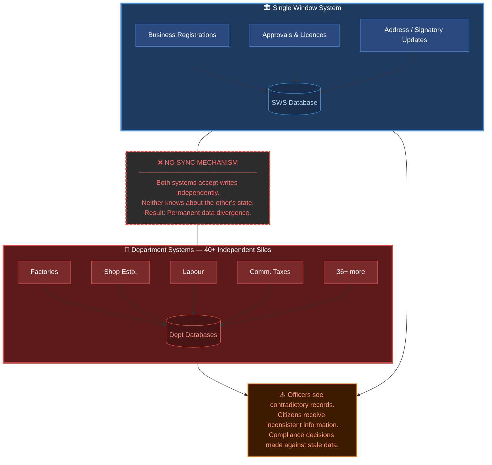
```mermaid
graph TB
    subgraph SWS["🏛️ Single Window System"]
        direction TB
        S1["Business Registrations"]
        S2["Approvals & Licences"]
        S3["Address / Signatory Updates"]
        SW[("SWS Database")]
        S1 & S2 & S3 --> SW
    end

    GAP["❌ NO SYNC MECHANISM\n─────────────────────────\nBoth systems accept writes independently.\nNeither knows about the other's state.\nResult: Permanent data divergence."]

    subgraph DEPT["🏢 Department Systems — 40+ Independent Silos"]
        direction TB
        D1["Factories"] & D2["Shop Estb."] & D3["Labour"] & D4["Comm. Taxes"] & D5["36+ more"]
        DW[("Dept Databases")]
        D1 & D2 & D3 & D4 & D5 --> DW
    end

    SWS --- GAP --- DEPT

    RESULT["⚠️ Officers see contradictory records.\nCitizens receive inconsistent information.\nCompliance decisions made against stale data."]

    DEPT --> RESULT
    SWS --> RESULT

    style SWS fill:#1e3a5f,stroke:#4a90d9,color:#fff,stroke-width:3px
    style DEPT fill:#5c1a1a,stroke:#d94a4a,color:#fff,stroke-width:3px
    style GAP fill:#2d2d2d,stroke:#e74c3c,color:#ff6b6b,stroke-width:3px,stroke-dasharray:6 3
    style RESULT fill:#3d1a00,stroke:#e67e22,color:#ffa07a,stroke-width:2px
    style SW fill:#1a2e50,stroke:#3498db,color:#aed6f1
    style DW fill:#4a1515,stroke:#e74c3c,color:#f1948a
    style D1 fill:#7a2a2a,stroke:#d94a4a,color:#fff
    style D2 fill:#7a2a2a,stroke:#d94a4a,color:#fff
    style D3 fill:#7a2a2a,stroke:#d94a4a,color:#fff
    style D4 fill:#7a2a2a,stroke:#d94a4a,color:#fff
    style D5 fill:#7a2a2a,stroke:#d94a4a,color:#fff
    style S1 fill:#2a4a7f,stroke:#4a90d9,color:#fff
    style S2 fill:#2a4a7f,stroke:#4a90d9,color:#fff
    style S3 fill:#2a4a7f,stroke:#4a90d9,color:#fff
```

### Concrete Manifestations

**Scenario 1 — Address Divergence:** A business updates its registered address through SWS. The new address is recorded in SWS. However, the Factories system, the Shop Establishment system, and the Labour system all retain the old address. Inspection notices are sent to the wrong location. Compliance filings reference different addresses depending on which system generated them.

**Scenario 2 — Signatory Inconsistency:** A company changes its authorised signatory. The update is made directly in the Factories system by an officer. SWS has no knowledge of this change. The old signatory's name continues to appear on SWS-generated documents. When the company interacts with SWS, they are asked to verify against outdated information.

**Scenario 3 — Concurrent Modification:** A business files an address change through SWS at 10:04 AM. Simultaneously, an officer in the Shop Establishment department corrects the same address at 10:04 AM based on a field verification report. Both systems accept the update. Neither system knows about the other's change. The records now permanently diverge.

**Scenario 4 — Identity Confusion:** Two businesses share similar names and operate at the same address (common in commercial complexes). A UBID lookup returns the wrong business. An update intended for Business A is applied to Business B's record. The error is discovered weeks later, but by then the incorrect data has propagated to three department systems.

### Why This Is Not a Minor Inconvenience

Data inconsistency in government systems has direct operational consequences:

- **Compliance failures:** Businesses receive contradictory instructions from different departments
- **Inspection errors:** Officers arrive at wrong locations or reference wrong responsible persons
- **Legal disputes:** Inconsistent records create ambiguity in enforcement actions
- **Citizen distrust:** Repeated encounters with incorrect data erode trust in digital governance
- **Officer burden:** Manual cross-verification across systems wastes thousands of person-hours annually
- **Policy blindness:** State-level analytics and reporting are unreliable when underlying records are inconsistent

---

## Real-World Context

### The GST Rollout Precedent

India's GST rollout in 2017 is the definitive case study for why big-bang system migrations fail at scale in the Indian governance context. The rollout attempted to replace multiple state and central tax systems with a single unified platform within a fixed cutover window.

The results:

| Impact Area | Outcome |
|---|---|
| **System downtime** | Repeated outages in the first 6 months, with filing deadlines repeatedly extended |
| **Data migration issues** | Millions of records migrated with field mapping errors, requiring months of manual correction |
| **Business disruption** | SMEs unable to file returns, leading to compliance penalties for system failures |
| **Recovery timeline** | System stability was not achieved for over 18 months post-launch |

**Key lesson:** Large-scale forced cutovers in Indian governance contexts carry unacceptable risk. The political, operational, and citizen-facing costs of failure are orders of magnitude higher than the costs of running parallel systems.

### Karnataka's Specific Landscape

Karnataka's department systems span a wide range of technological maturity:

| Category | Systems | Characteristics |
|---|---|---|
| **Modern (Tier 1)** | 5–8 systems | REST APIs with webhook/event support, JSON payloads, API versioning |
| **Semi-modern (Tier 2)** | 10–15 systems | REST APIs without events, database accessible for CDC, structured schemas |
| **Legacy (Tier 3)** | 15–20+ systems | Opaque APIs, SOAP/XML, no event capability, no database access, batch-oriented |

No solution can exclude any tier. Every department system must be integrated, regardless of its technological capability.

### The UBID Reality

The Unique Business Identification Number (UBID) is Karnataka's attempt at a universal business identifier. In theory, every business registered in the state has a unique UBID that is consistent across all systems. In practice:

- **Approximate matching:** UBID lookup is sometimes fuzzy, especially for businesses registered before UBID was mandated
- **Duplicate registrations:** Some businesses have multiple UBIDs due to registration through different entry points
- **Typographical errors:** Manual UBID entry in legacy systems introduces transcription errors
- **Delayed issuance:** Some businesses operate for weeks before their UBID propagates to all systems

Any solution that treats UBID as a perfectly reliable identifier will silently produce incorrect results. UBID uncertainty must be modelled explicitly.

---

## Constraints & Challenges

### Hard Constraints (Non-Negotiable)

| # | Constraint | Implication |
|---|---|---|
| C1 | **No modification to SWS** | Cannot add events, change schemas, or deploy agents inside SWS |
| C2 | **No modification to department systems** | Same restriction applies to all 40+ department systems |
| C3 | **UBID is the only join key** | No other identifier is guaranteed to exist across all systems |
| C4 | **All department systems must be supported** | Cannot exclude legacy systems that lack modern integration capabilities |
| C5 | **Bidirectional sync required** | Changes flow SWS → departments AND departments → SWS |
| C6 | **Zero data loss tolerance** | No update may be silently dropped, even during failures |
| C7 | **Audit trail required** | Every propagation must be traceable for legal and governance purposes |

### Soft Constraints (Design Considerations)

| # | Constraint | Implication |
|---|---|---|
| S1 | **Latency varies by system** | Modern systems can sync in real-time; legacy systems may have minutes of delay |
| S2 | **Schema heterogeneity** | Each department has its own field names, formats, enumerations, and validation rules |
| S3 | **Concurrent updates are inevitable** | Multiple systems will update the same record within seconds of each other |
| S4 | **Human review capacity is limited** | The system cannot generate more manual review items than a small team can handle |
| S5 | **Political sensitivity** | No department can perceive the system as "overriding" their authority |
| S6 | **Incremental onboarding** | Departments must be addable one at a time, not all at once |

### Technical Challenges

1. **Heterogeneous event capability:** Systems range from native webhook emitters to fully opaque batch systems. The fabric must detect changes regardless of the system's cooperation level.

2. **Schema drift:** Department systems change their API schemas without notice. The fabric must detect, flag, and handle schema changes gracefully.

3. **Imperfect identity:** UBID resolution is probabilistic in edge cases. The system must track confidence, handle errors, and compensate for incorrect identity assignments.

4. **Concurrent conflict resolution:** When two systems update the same field on the same record within seconds, the resolution must be deterministic, explainable, and consistent regardless of processing order.

5. **Exactly-once semantics across unreliable boundaries:** Network failures, API timeouts, and duplicate deliveries are inevitable. The system must guarantee that each logical update is applied exactly once.

6. **Auditability under complexity:** With millions of events flowing through the system, the audit trail must support efficient querying, causal traversal, and root cause analysis — not just append-only logging.

---

## Why Existing Approaches Fail

### Approach 1: Point-to-Point Integration

**Description:** Build direct integration links between each pair of systems (SWS ↔ Factories, SWS ↔ Shop Establishment, etc.).

**Why it fails:**

- **Quadratic complexity:** N systems require O(N²) integration links. With 40+ systems, this means 800+ individual integrations.
- **No conflict resolution:** When two systems disagree on a field value, there is no centralised mechanism to determine which is correct.
- **No audit trail:** Each integration link operates independently. There is no unified view of how data moved through the ecosystem.
- **No schema normalisation:** Each link must independently handle the schema differences between its two endpoints.
- **Maintenance nightmare:** A schema change in one system requires updating every link connected to it.

### Approach 2: Central Master Database

**Description:** Build a single "golden record" database and treat it as the source of truth. All systems sync to and from this central store.

**Why it fails:**

- **Violates C1 and C2:** Requires every system to change its write path to go through the central database, or at minimum to accept writes from it.
- **Single point of failure:** The central database becomes the bottleneck and failure point for the entire ecosystem.
- **Political infeasibility:** No department will accept that "their" data is subordinate to a central store they do not control.
- **Conflict resolution still unsolved:** The central database must still resolve concurrent updates, and timestamp-based resolution loses data.

### Approach 3: ESB (Enterprise Service Bus)

**Description:** Deploy an ESB (e.g., MuleSoft, WSO2) to mediate all communication between systems.

**Why it fails:**

- **Message transformation, not state convergence:** ESBs are designed for message routing and transformation, not for ensuring that multiple independent data stores converge to the same state.
- **No CRDT-based conflict resolution:** ESBs use routing rules, not convergence guarantees. Concurrent updates are handled by last-in-wins or manual rules, both of which lose data.
- **No evidence graph:** ESB logging is operational (request/response pairs), not causal (why is this field set to this value).
- **No compensation model:** ESBs route messages forward. They do not model sagas, compensating actions, or identity correction workflows.
- **Heavyweight deployment:** ESBs require significant infrastructure, licensing, and operational overhead that is disproportionate to the problem.

### Approach 4: Batch ETL Synchronisation

**Description:** Periodically extract data from all systems, transform it into a common format, and load corrections back.

**Why it fails:**

- **Latency:** Batch windows introduce hours or days of inconsistency. An address updated in SWS at 9 AM may not reach the Factories system until the next night's batch run.
- **Conflict blindness:** If two systems updated the same field during the batch window, the ETL process has no mechanism to detect or resolve the conflict — it simply takes whichever value it processes last.
- **No auditability:** ETL processes produce load logs, not causal audit trails. "Why was this field overwritten?" is unanswerable.
- **Brittle schema coupling:** ETL pipelines break when source schemas change, and changes are often discovered only when the pipeline fails in production.

### Why UBID Fabric Is Different

UBID Fabric does not route messages. It does not copy data. It does not maintain a master record. Instead, it:

1. **Detects changes** at every system using the most appropriate method for that system's capability level
2. **Converts every change into an immutable, self-describing canonical event**
3. **Resolves conflicts deterministically** using formally-proven convergent data structures (CRDTs)
4. **Propagates the converged state** to every relevant system using saga-based execution with compensation
5. **Records every step** in a causal evidence graph that supports legal-grade audit

This is a fundamentally different approach that treats the problem as **distributed state convergence** rather than data integration.

---

## Solution Overview

### What UBID Fabric Is

UBID Fabric is an event-driven, bidirectional interoperability fabric that ensures every change — regardless of where it originates — is detected, normalised, conflict-resolved, propagated, and audited across Karnataka's SWS and all connected department systems.

It is:

- **Non-invasive:** It does not modify any source system. It uses only the APIs, webhooks, databases, and data surfaces that each system already exposes.
- **Bidirectional:** Changes flow from SWS to departments and from departments to SWS with identical guarantees.
- **Deterministic:** Given the same set of events, the system will always produce the same final state, regardless of the order events are received or processed.
- **Auditable:** Every event, decision, and write is recorded in an immutable causal graph that supports end-to-end traceability.
- **Incremental:** New department systems are onboarded by adding a schema mapping and a connector — no code changes, no redeployment of existing components.

### What UBID Fabric Is Not

- **Not a master database:** It does not replace any system's data store. Each system retains its own database as before.
- **Not an ESB:** It does not route messages between systems. It converges state across systems.
- **Not a migration tool:** It does not move data from old systems to new systems. It keeps all systems synchronised while they coexist.
- **Not a replacement for SWS:** SWS remains the primary citizen-facing interface. UBID Fabric ensures that what citizens see in SWS matches what exists in department systems.

### High-Level Flow

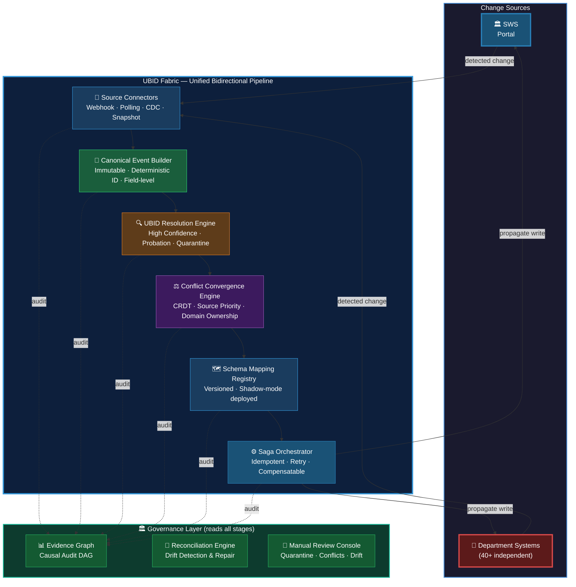
```mermaid
graph TB
    subgraph SOURCES["Change Sources"]
        direction LR
        SWS["🏛️ SWS\nPortal"]
        DEPT["🏢 Department Systems\n(40+ independent)"]
    end

    subgraph PIPELINE["UBID Fabric — Unified Bidirectional Pipeline"]
        direction TB
        CONN["🔌 Source Connectors\nWebhook · Polling · CDC · Snapshot"]
        EVT["📝 Canonical Event Builder\nImmutable · Deterministic ID · Field-level"]
        UBID["🔍 UBID Resolution Engine\nHigh Confidence · Probation · Quarantine"]
        CONFLICT["⚖️ Conflict Convergence Engine\nCRDT · Source Priority · Domain Ownership"]
        SCHEMA["🗺️ Schema Mapping Registry\nVersioned · Shadow-mode deployed"]
        SAGA["⚙️ Saga Orchestrator\nIdempotent · Retry · Compensatable"]
    end

    subgraph GOV["🏛️ Governance Layer (reads all stages)"]
        direction LR
        EG["📊 Evidence Graph\nCausal Audit DAG"]
        RE["🔄 Reconciliation Engine\nDrift Detection & Repair"]
        MRC["👤 Manual Review Console\nQuarantine · Conflicts · Drift"]
    end

    SWS -->|"detected change"| CONN
    DEPT -->|"detected change"| CONN
    CONN --> EVT --> UBID --> CONFLICT --> SCHEMA --> SAGA
    SAGA -->|"propagate write"| SWS
    SAGA -->|"propagate write"| DEPT

    CONN -.->|"audit"| EG
    EVT -.->|"audit"| EG
    UBID -.->|"audit"| EG
    CONFLICT -.->|"audit"| EG
    SCHEMA -.->|"audit"| EG
    SAGA -.->|"audit"| EG

    style SOURCES fill:#1a1a2e,stroke:#4a90d9,color:#fff,stroke-width:2px
    style PIPELINE fill:#0d1f3c,stroke:#3498db,color:#fff,stroke-width:3px
    style GOV fill:#0d3b2e,stroke:#1abc9c,color:#fff,stroke-width:2px
    style SWS fill:#1a5276,stroke:#2980b9,color:#fff,stroke-width:3px
    style DEPT fill:#5c1a1a,stroke:#d94a4a,color:#fff,stroke-width:3px
    style CONN fill:#1a3c5e,stroke:#3498db,color:#fff
    style EVT fill:#1a5e3c,stroke:#2ecc71,color:#fff
    style UBID fill:#5e3c1a,stroke:#e67e22,color:#fff
    style CONFLICT fill:#3c1a5e,stroke:#9b59b6,color:#fff
    style SCHEMA fill:#1a3c5e,stroke:#3498db,color:#fff
    style SAGA fill:#1a5276,stroke:#2980b9,color:#fff
    style EG fill:#145a32,stroke:#27ae60,color:#fff
    style RE fill:#145a32,stroke:#27ae60,color:#fff
    style MRC fill:#145a32,stroke:#27ae60,color:#fff
```

---

## Core Design Principles

### Principle 1: Every Change Is an Immutable Event

**What:** Every field-level change detected at any system is converted into an immutable canonical event and appended to a write-once event log before any processing begins.

**Why:** Immutability provides the foundation for replay, audit, and deterministic convergence. If any component fails, the event is never lost — it can be replayed from the log. If any decision is questioned, the original event is always available for inspection. If any future component needs historical data, the complete event history is available.

**Trade-off:** Storage cost. An immutable event log grows indefinitely. We mitigate this with tiered storage (hot → warm → cold) and checkpoint-based compaction for operational queries. The log itself is never compacted — it serves as the legal record.

### Principle 2: State Always Converges Deterministically

**What:** When concurrent updates target the same UBID and field, the system resolves the conflict using CRDT (Conflict-free Replicated Data Type) rules that guarantee the same final state regardless of event processing order.

**Why:** Traditional last-write-wins (based on wall clock timestamps) is non-deterministic — the "winning" value depends on which update is processed last, which depends on network latency, queue ordering, and processing delays. This means two replays of the same events can produce different results. CRDTs eliminate this: the merge function is commutative, associative, and idempotent, guaranteeing that any processing order produces the same result.

**Trade-off:** CRDTs resolve a strict subset of conflict types. Complex semantic conflicts (e.g., "should this business be classified under Industry Code A or Industry Code B?") require domain-specific policy or human review. The CRDT layer handles the cases that can be resolved deterministically; the policy layer and manual review handle the rest.

### Principle 3: Identity Uncertainty Is Explicit

**What:** Every UBID resolution is assigned a confidence state: High Confidence, Probation, or Quarantine. The confidence state determines how the event is propagated and whether human review is required.

**Why:** Treating UBID as always correct leads to silent data corruption when it is wrong. Treating UBID as always uncertain leads to excessive manual review that overwhelms human capacity. The three-state model allows the system to proceed confidently in the common case (high confidence), proceed cautiously in the uncertain case (probation), and stop for human review in the unreliable case (quarantine).

**Trade-off:** The probation state introduces a flag on propagated writes that downstream systems must be aware of. In practice, this flag is implemented as a metadata field in the canonical event and does not require changes to department systems — it is tracked internally by the fabric and surfaced in the Manual Review Console.

### Principle 4: Audit Is a First-Class Data Structure

**What:** The audit trail is not a sequence of log lines. It is a directed acyclic graph (DAG) where every event, translation, conflict detection, resolution decision, write, retry, compensation, and replay is a node, and edges record causal relationships (caused_by, resolved_by, superseded_by, compensated_by, replayed_as).

**Why:** Flat logs answer "what happened." Causal graphs answer "why did this happen" and "what would have happened differently if this event had not occurred." Government audit requirements demand not just traceability but explainability — an officer must be able to understand why a particular field has a particular value in a particular system at a particular time.

**Trade-off:** Graph storage and querying is more complex than append-only logging. We accept this complexity because the audit use case demands it, and modern graph query engines (or materialised graph views in PostgreSQL) provide adequate performance.

### Principle 5: Failure Is Expected and Designed For

**What:** Every component assumes that any external system call may fail, any event may be delivered more than once, any schema may change without notice, and any identity resolution may be incorrect. Failure handling is not an afterthought — it is a first-class design concern.

**Why:** In a production environment involving 40+ heterogeneous systems, failures are not edge cases — they are the normal operating condition. A system that handles failure gracefully is more valuable than a system that handles the happy path elegantly.

**Trade-off:** Defensive design adds complexity. Every write path includes retry logic, idempotency checks, compensation capability, and dead-letter handling. We accept this complexity because the alternative — silent data loss or inconsistency — is unacceptable.

---

## System Architecture (Layered)

UBID Fabric is organised into six layers, each with a distinct responsibility. Layers communicate through well-defined interfaces, and each layer can be independently scaled, upgraded, or replaced.

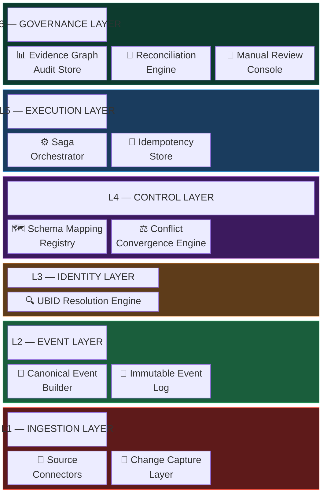
```mermaid
block-beta
    columns 3

    block:L6:3
        columns 3
        L6T["L6 — GOVERNANCE LAYER"]:3
        EG["📊 Evidence Graph\nAudit Store"]
        RC["🔄 Reconciliation\nEngine"]
        MRC["👤 Manual Review\nConsole"]
    end

    block:L5:3
        columns 3
        L5T["L5 — EXECUTION LAYER"]:3
        SO["⚙️ Saga\nOrchestrator"]
        IS["🔑 Idempotency\nStore"]
        space
    end

    block:L4:3
        columns 3
        L4T["L4 — CONTROL LAYER"]:3
        SMR["🗺️ Schema Mapping\nRegistry"]
        CCE["⚖️ Conflict\nConvergence Engine"]
        space
    end

    block:L3:3
        columns 3
        L3T["L3 — IDENTITY LAYER"]:3
        URE["🔍 UBID Resolution Engine"]:3
    end

    block:L2:3
        columns 3
        L2T["L2 — EVENT LAYER"]:3
        CEB["📝 Canonical Event\nBuilder"]
        IEL["💾 Immutable Event\nLog"]
        space
    end

    block:L1:3
        columns 3
        L1T["L1 — INGESTION LAYER"]:3
        SC["🔌 Source\nConnectors"]
        CCL["📡 Change Capture\nLayer"]
        space
    end

    style L6 fill:#0d3b2e,stroke:#1abc9c,color:#fff
    style L5 fill:#1a3c5e,stroke:#3498db,color:#fff
    style L4 fill:#3c1a5e,stroke:#9b59b6,color:#fff
    style L3 fill:#5e3c1a,stroke:#e67e22,color:#fff
    style L2 fill:#1a5e3c,stroke:#2ecc71,color:#fff
    style L1 fill:#5e1a1a,stroke:#e74c3c,color:#fff
```

Alternative view as a flowchart:

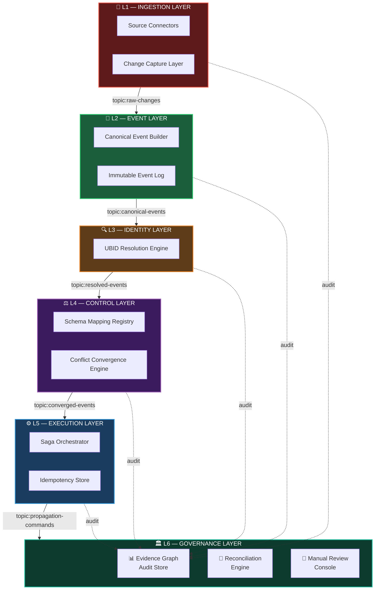
```mermaid
graph TB
    subgraph L6["🏛️ L6 — GOVERNANCE LAYER"]
        EG["📊 Evidence Graph<br/>Audit Store"]
        RCE["🔄 Reconciliation<br/>Engine"]
        MRC["👤 Manual Review<br/>Console"]
    end

    subgraph L5["⚙️ L5 — EXECUTION LAYER"]
        SO["Saga Orchestrator"]
        IS["Idempotency Store"]
    end

    subgraph L4["⚖️ L4 — CONTROL LAYER"]
        SMR["Schema Mapping Registry"]
        CCE["Conflict Convergence Engine"]
    end

    subgraph L3["🔍 L3 — IDENTITY LAYER"]
        URE["UBID Resolution Engine"]
    end

    subgraph L2["📝 L2 — EVENT LAYER"]
        CEB["Canonical Event Builder"]
        IEL["Immutable Event Log"]
    end

    subgraph L1["🔌 L1 — INGESTION LAYER"]
        SC["Source Connectors"]
        CCL["Change Capture Layer"]
    end

    L1 -->|"topic:raw-changes"| L2
    L2 -->|"topic:canonical-events"| L3
    L3 -->|"topic:resolved-events"| L4
    L4 -->|"topic:converged-events"| L5
    L5 -->|"topic:propagation-commands"| L6

    L1 -.->|audit| EG
    L2 -.->|audit| EG
    L3 -.->|audit| EG
    L4 -.->|audit| EG
    L5 -.->|audit| EG

    style L6 fill:#0d3b2e,stroke:#1abc9c,color:#fff,stroke-width:2px
    style L5 fill:#1a3c5e,stroke:#3498db,color:#fff,stroke-width:2px
    style L4 fill:#3c1a5e,stroke:#9b59b6,color:#fff,stroke-width:2px
    style L3 fill:#5e3c1a,stroke:#e67e22,color:#fff,stroke-width:2px
    style L2 fill:#1a5e3c,stroke:#2ecc71,color:#fff,stroke-width:2px
    style L1 fill:#5e1a1a,stroke:#e74c3c,color:#fff,stroke-width:2px
```

### Layer Responsibilities

| Layer | Name | Responsibility | Key Components |
|---|---|---|---|
| L1 | **Ingestion** | Detect and capture changes from all source systems using the most appropriate method for each system's capability | Source Connectors, Change Capture Layer |
| L2 | **Event** | Convert raw changes into immutable, self-describing canonical events and store them permanently | Canonical Event Builder, Immutable Event Log |
| L3 | **Identity** | Resolve and validate the UBID for every event, assigning confidence states and handling corrections | UBID Resolution Engine |
| L4 | **Control** | Apply schema mappings and resolve conflicts using CRDT rules and policy escalation | Schema Mapping Registry, Conflict Convergence Engine |
| L5 | **Execution** | Coordinate writes to target systems with saga-based orchestration and idempotency guarantees | Saga Orchestrator, Idempotency Store |
| L6 | **Governance** | Provide audit, reconciliation, and human review capabilities | Evidence Graph Audit Store, Reconciliation Engine, Manual Review Console |

### Inter-Layer Communication

All inter-layer communication flows through Apache Kafka topics. Each layer publishes its output to a topic and the next layer consumes from it. This provides:

- **Decoupling:** Layers do not know about each other's implementation
- **Buffering:** Producers and consumers can operate at different speeds
- **Replay:** Any layer can be replayed by resetting its consumer offset
- **Observability:** Topic lag provides real-time visibility into processing delays

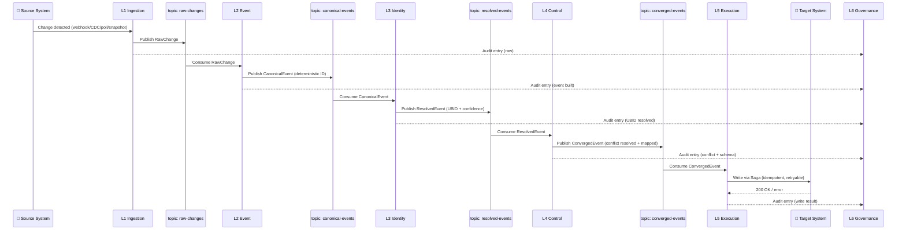
```mermaid
sequenceDiagram
    participant SRC as 🔌 Source System
    participant L1 as L1 Ingestion
    participant T1 as topic: raw-changes
    participant L2 as L2 Event
    participant T2 as topic: canonical-events
    participant L3 as L3 Identity
    participant T3 as topic: resolved-events
    participant L4 as L4 Control
    participant T4 as topic: converged-events
    participant L5 as L5 Execution
    participant TGT as 🏢 Target System
    participant L6 as L6 Governance

    SRC->>L1: Change detected (webhook/CDC/poll/snapshot)
    L1->>T1: Publish RawChange
    L1-->>L6: Audit entry (raw)

    T1->>L2: Consume RawChange
    L2->>T2: Publish CanonicalEvent (deterministic ID)
    L2-->>L6: Audit entry (event built)

    T2->>L3: Consume CanonicalEvent
    L3->>T3: Publish ResolvedEvent (UBID + confidence)
    L3-->>L6: Audit entry (UBID resolved)

    T3->>L4: Consume ResolvedEvent
    L4->>T4: Publish ConvergedEvent (conflict resolved + mapped)
    L4-->>L6: Audit entry (conflict + schema)

    T4->>L5: Consume ConvergedEvent
    L5->>TGT: Write via Saga (idempotent, retryable)
    TGT-->>L5: 200 OK / error
    L5-->>L6: Audit entry (write result)
```

---

## Component Deep Dive

### Component 1: Source Connectors

**Purpose:** Adapt to whatever interface each source system exposes and detect changes as they occur.

**Design:**

Each source system gets a dedicated connector instance. The connector encapsulates all system-specific knowledge: API endpoints, authentication mechanisms, payload formats, rate limits, and retry policies. The connector's output is always a uniform `RawChange` structure, regardless of how the change was detected.

**Connector Types:**

| Type | Method | Latency | Used When |
|---|---|---|---|
| **Webhook Connector** | Subscribes to system-emitted events | < 1 second | System supports webhook/event registration |
| **Polling Connector** | Periodically queries a REST API for changes (using modified-since, cursor, or version filters) | 5–30 seconds | System has REST API but no event capability |
| **CDC Connector** | Uses Debezium to capture row-level changes from the system's database transaction log | 1–5 seconds | System's database is accessible and supports CDC (PostgreSQL, MySQL, etc.) |
| **Snapshot Connector** | Periodically captures a full or partial snapshot of the system's state and diffs it against the previous snapshot | 1–15 minutes | System has opaque API with no delta capability and no database access |

**Connector Interface:**

```json
{
  "connector_id": "conn-factories-001",
  "source_system": "FACTORIES",
  "connector_type": "CDC",
  "raw_change": {
    "entity_type": "business_registration",
    "entity_id": "FAC-2024-KA-00847",
    "changed_fields": {
      "authorised_signatory": {
        "old_value": "Rajesh Kumar",
        "new_value": "Priya Sharma"
      }
    },
    "change_timestamp": "2024-03-15T10:04:23.456+05:30",
    "capture_method": "debezium_cdc",
    "capture_timestamp": "2024-03-15T10:04:23.892+05:30"
  }
}
```

**Reliability Guarantees:**

- **At-least-once delivery:** Every connector guarantees that detected changes are published to the raw-changes topic at least once. Duplicates are handled downstream by the idempotency layer.
- **Checkpoint-based recovery:** Each connector maintains a checkpoint (offset, cursor, snapshot hash) that survives restarts. On recovery, the connector resumes from the last checkpoint, not from the beginning.
- **Health monitoring:** Each connector emits heartbeat events. If a connector fails to emit a heartbeat within its configured interval, an alert is raised and the connector is automatically restarted.

**Scaling Model:**

Each connector runs as an independent process (Kubernetes pod). Connector instances can be added, removed, or restarted independently. The number of connectors scales linearly with the number of source systems.

---

### Component 2: Change Capture Layer

**Purpose:** Normalise the raw change from any connector into a structured, typed payload that is ready for canonical event construction.

**Design:**

The Change Capture Layer performs four functions:

1. **Field Extraction:** Parses the raw change payload and extracts individual field-level changes.
2. **Type Validation:** Validates each field value against the registered schema for that source system and field.
3. **Normalisation:** Applies basic normalisation rules (trimming whitespace, normalising date formats to ISO 8601, normalising case for enum values).
4. **Schema Drift Detection:** Compares the incoming payload structure against the registered schema version. If new fields appear, existing fields disappear, or field types change, a schema drift alert is raised.

**Schema Drift Handling:**

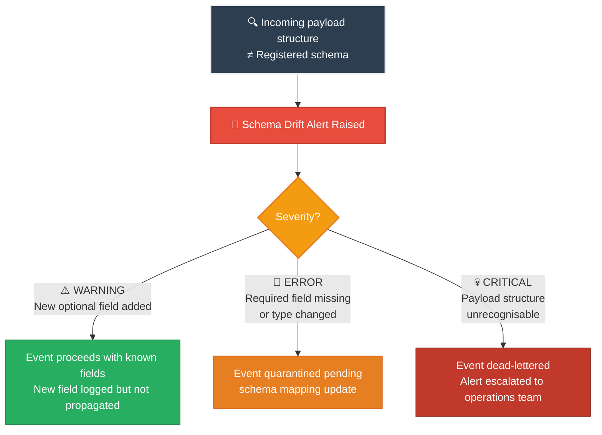
```mermaid
flowchart TB
    A["🔍 Incoming payload structure<br/>≠ Registered schema"] --> B["🚨 Schema Drift Alert Raised"]

    B --> C{"Severity?"}

    C -->|"⚠️ WARNING<br/>New optional field added"| D["Event proceeds with known fields<br/>New field logged but not propagated"]

    C -->|"🔴 ERROR<br/>Required field missing<br/>or type changed"| E["Event quarantined pending<br/>schema mapping update"]

    C -->|"💀 CRITICAL<br/>Payload structure<br/>unrecognisable"| F["Event dead-lettered<br/>Alert escalated to operations team"]

    style A fill:#2c3e50,stroke:#ecf0f1,color:#fff,stroke-width:2px
    style B fill:#e74c3c,stroke:#c0392b,color:#fff,stroke-width:2px
    style C fill:#f39c12,stroke:#e67e22,color:#fff,stroke-width:2px
    style D fill:#27ae60,stroke:#1e8449,color:#fff
    style E fill:#e67e22,stroke:#d35400,color:#fff
    style F fill:#c0392b,stroke:#922b21,color:#fff
```

---

### Component 3: Canonical Event Builder

**Purpose:** Wrap every normalised change in an immutable, versioned, self-describing canonical event that can be processed uniformly by all downstream layers.

**Canonical Event Schema:**

```json
{
  "event_id": "sha256(ubid + source_system + lamport_ts + payload_hash)",
  "event_version": "1.0",
  "ubid": "UBID-KA-2024-00000847",
  "source_system": "FACTORIES",
  "lamport_timestamp": 1710487463456,
  "wall_clock_timestamp": "2024-03-15T10:04:23.456+05:30",
  "entity_type": "business_registration",
  "change_type": "FIELD_UPDATE",
  "field_changes": [
    {
      "field_name": "authorised_signatory",
      "field_type": "STRING",
      "old_value": "Rajesh Kumar",
      "new_value": "Priya Sharma",
      "crdt_type": "LWW_REGISTER"
    }
  ],
  "payload_hash": "sha256(canonical_json(field_changes))",
  "metadata": {
    "connector_id": "conn-factories-001",
    "capture_method": "debezium_cdc",
    "capture_latency_ms": 436,
    "mapping_version": "v3.2.1",
    "policy_version": "v2.0.0",
    "resolver_version": "v1.4.0"
  }
}
```

**Key Design Decisions:**

- **Deterministic Event ID:** The event ID is a cryptographic hash of the UBID, source system, Lamport timestamp, and payload hash. This means the same logical event always produces the same event ID, regardless of when or how many times it is processed. This is the foundation of idempotency.

- **Lamport Timestamps:** Wall clock timestamps are unreliable across distributed systems (clock skew, NTP drift). Lamport timestamps provide a causally-consistent ordering without requiring synchronised clocks. The Lamport timestamp is incremented on each event and updated to max(local, received) + 1 on each received event, ensuring that causally related events are always ordered correctly.

- **Field-Level Granularity:** Changes are tracked at the field level, not the record level. This enables field-specific conflict resolution (e.g., address uses LWW, signatories use OR-set) and prevents a change to one field from overwriting an unrelated change to another field on the same record.

- **Version Pinning:** The event records which version of the schema mapping, conflict policy, and UBID resolver was in effect when it was created. This enables reproducible replay — replaying an event applies the same rules that were in effect when it was first processed.

---

### Component 4: Immutable Event Log

**Purpose:** Provide a durable, append-only store for every canonical event ever produced.

**Implementation:**

The immutable event log is backed by two systems:

1. **Apache Kafka** (hot path): Canonical events are published to a partitioned Kafka topic (partitioned by UBID for ordering guarantees within a single business entity). Kafka provides durable, replayable event storage with configurable retention.

2. **PostgreSQL** (cold path): Every canonical event is also written to a PostgreSQL table with a JSONB payload column and indexed by event_id, ubid, source_system, and lamport_timestamp. This provides queryable access for audit, reconciliation, and replay without requiring Kafka consumer reset.

**Guarantees:**

- **Append-only:** No event is ever updated or deleted. The only operation is INSERT.
- **Ordered within UBID:** All events for a given UBID are stored in Lamport timestamp order within their Kafka partition.
- **Replayable:** Any consumer can be reset to any offset to replay events from any point in time.
- **Durable:** Kafka replication factor of 3 ensures no data loss on single-node failure. PostgreSQL WAL replication provides additional durability.

**Retention Policy:**

| Tier | Storage | Retention | Access Pattern |
|---|---|---|---|
| Hot | Kafka | 30 days | Real-time consumption |
| Warm | PostgreSQL | 2 years | Query-based access |
| Cold | Object Storage (S3-compatible) | Indefinite | Archival and legal hold |

---

### Component 5: UBID Resolution Engine

**Purpose:** Validate and resolve the UBID for every canonical event before any propagation occurs.

**Detailed design covered in [Identity Resolution (UBID Handling)](#identity-resolution-ubid-handling).**

---

### Component 6: Schema Mapping Registry

**Purpose:** Store and manage bidirectional field mappings between SWS and each department system.

**Design:**

Each schema mapping is a versioned artefact that specifies:

1. **Field correspondences:** Which SWS field corresponds to which department system field
2. **Transformation functions:** How field values are transformed between systems (date format conversion, address field splitting/joining, enum value translation)
3. **Validation rules:** What constraints apply to transformed values (length limits, character restrictions, required fields)
4. **Directionality:** Whether the mapping applies SWS→Department, Department→SWS, or both

**Example Mapping:**

```json
{
  "mapping_id": "map-sws-factories-v3.2.1",
  "source": "SWS",
  "target": "FACTORIES",
  "version": "3.2.1",
  "created_at": "2024-03-01T00:00:00Z",
  "status": "ACTIVE",
  "field_mappings": [
    {
      "source_field": "registered_address",
      "target_field": "factory_address_line1",
      "transform": "SPLIT_ADDRESS_LINE_1",
      "direction": "BIDIRECTIONAL",
      "validation": {
        "max_length": 200,
        "required": true
      }
    },
    {
      "source_field": "registered_address",
      "target_field": "factory_address_line2",
      "transform": "SPLIT_ADDRESS_LINE_2",
      "direction": "BIDIRECTIONAL"
    },
    {
      "source_field": "authorised_signatories",
      "target_field": "signatory_name",
      "transform": "PRIMARY_SIGNATORY_EXTRACT",
      "direction": "BIDIRECTIONAL",
      "notes": "Factories system stores only primary signatory as string; SWS stores list"
    },
    {
      "source_field": "establishment_date",
      "target_field": "date_of_registration",
      "transform": "DATE_FORMAT_ISO_TO_DDMMYYYY",
      "direction": "BIDIRECTIONAL"
    }
  ]
}
```

**Schema Mapping Lifecycle:**

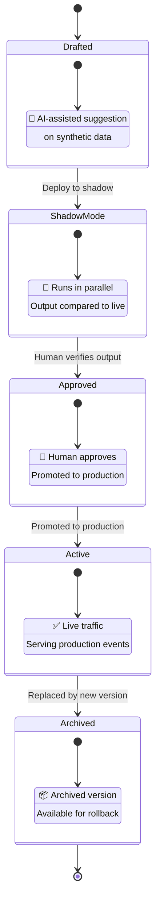
```mermaid
stateDiagram-v2
    [*] --> Drafted
    Drafted --> ShadowMode : Deploy to shadow
    ShadowMode --> Approved : Human verifies output
    Approved --> Active : Promoted to production
    Active --> Archived : Replaced by new version
    Archived --> [*]

    state Drafted {
        [*] --> AIAnalysis
        AIAnalysis : 🤖 AI-assisted suggestion
        AIAnalysis : on synthetic data
    }

    state ShadowMode {
        [*] --> ParallelRun
        ParallelRun : 🔄 Runs in parallel
        ParallelRun : Output compared to live
    }

    state Approved {
        [*] --> HumanReview
        HumanReview : 👤 Human approves
        HumanReview : Promoted to production
    }

    state Active {
        [*] --> LiveTraffic
        LiveTraffic : ✅ Live traffic
        LiveTraffic : Serving production events
    }

    state Archived {
        [*] --> Stored
        Stored : 📦 Archived version
        Stored : Available for rollback
    }
```

**Shadow Mode:** When a new or updated mapping is deployed, it runs in shadow mode alongside the active mapping. Both mappings process the same events. The shadow mapping's output is compared against the active mapping's output. Discrepancies are logged. The shadow mapping is promoted only after a human reviewer verifies that its output is correct. This prevents mapping errors from corrupting production data.

---

### Component 7: Conflict Convergence Engine

**Purpose:** Detect and resolve conflicts when multiple canonical events target the same UBID and field within the conflict detection window.

**Detailed design covered in [Conflict Resolution Strategy](#conflict-resolution-strategy-crdt--policy).**

---

### Component 8: Saga Orchestrator

**Purpose:** Coordinate writes to each target system as independent, compensatable saga steps.

**Detailed design covered in [Propagation & Execution Model](#propagation--execution-model-saga).**

---

### Component 9: Idempotency Store

**Purpose:** Guarantee exactly-once processing of every canonical event, across retries, replays, and duplicate deliveries.

**Detailed design covered in [Idempotency Design](#idempotency-design).**

---

### Component 10: Evidence Graph Audit Store

**Purpose:** Maintain a queryable causal graph of every event, decision, and action in the system.

**Detailed design covered in [Audit & Observability](#audit--observability-evidence-graph).**

---

### Component 11: Reconciliation Engine

**Purpose:** Periodically compare expected state (from event log) against actual state (from live systems) and detect drift.

**Detailed design covered in [Reconciliation Engine](#reconciliation-engine).**

---

### Component 12: Manual Review Console

**Purpose:** Provide a human-in-the-loop interface for quarantined events, unresolvable conflicts, and reconciliation escalations.

**Design:**

The Manual Review Console is a web application that presents reviewers with:

1. **Quarantine Queue:** Events where UBID resolution confidence is below the propagation threshold. The reviewer sees the event details, the UBID candidates, the confidence scores, and the matching criteria. The reviewer selects the correct UBID or creates a new association.

2. **Conflict Queue:** Conflicts that reached Level 4 (no automated policy resolves the conflict). The reviewer sees both competing events, the field values, the source systems, the policies that were attempted, and the reasons they did not resolve. The reviewer selects the winning value and provides a justification.

3. **Reconciliation Queue:** Drift instances detected by the reconciliation engine that are ambiguous (e.g., the expected value and the actual value both differ from the last propagated value). The reviewer determines whether to re-propagate, accept the actual value, or escalate further.

4. **Causal Context View:** For any item in any queue, the reviewer can view the full causal chain in the evidence graph — every event, translation, conflict, resolution, and write that led to the current state.

**Reviewer Decision Recording:**

Every reviewer decision is recorded as a node in the evidence graph:

```json
{
  "node_type": "MANUAL_DECISION",
  "decision_id": "dec-20240315-001",
  "reviewer_id": "reviewer-001",
  "queue": "CONFLICT",
  "input_events": ["evt-001", "evt-002"],
  "decision": {
    "winning_value": "123 MG Road, Bengaluru",
    "losing_value": "456 Brigade Road, Bengaluru",
    "justification": "SWS value verified against business registration certificate"
  },
  "timestamp": "2024-03-15T14:30:00Z"
}
```

---

## Data Model & Canonical Events

### Canonical Event Schema (Complete)

The canonical event is the fundamental data unit of UBID Fabric. Every change flowing through the system is represented as exactly one canonical event. The schema is designed to be self-describing, deterministically identifiable, and replayable.

```json
{
  "$schema": "https://ubid-fabric.karnataka.gov.in/schemas/canonical-event-v1.json",
  "event_id": "string — sha256(ubid + source_system + lamport_ts + payload_hash)",
  "event_version": "string — semantic version of the event schema",
  "ubid": "string — Unique Business Identification Number",
  "ubid_confidence": "enum — HIGH_CONFIDENCE | PROBATION | QUARANTINE",
  "source_system": "string — originating system identifier",
  "event_type": "enum — FIELD_UPDATE | ENTITY_CREATE | ENTITY_DELETE | COMPENSATION | REPLAY",
  "lamport_timestamp": "integer — monotonically increasing logical clock",
  "wall_clock_timestamp": "string — ISO 8601 with timezone",
  "entity_type": "string — business_registration | licence | permit | etc.",
  "field_changes": [
    {
      "field_name": "string — canonical field name",
      "field_type": "enum — STRING | INTEGER | DECIMAL | DATE | BOOLEAN | SET | LIST",
      "crdt_type": "enum — LWW_REGISTER | OR_SET | MONOTONIC_COUNTER | NONE",
      "old_value": "any — previous value (null for creation events)",
      "new_value": "any — new value",
      "source_field_name": "string — original field name in the source system"
    }
  ],
  "payload_hash": "string — sha256 of canonical JSON of field_changes",
  "causality": {
    "caused_by": "string | null — event_id of the event that caused this event",
    "correlation_id": "string — shared ID for all events in the same user-initiated change"
  },
  "metadata": {
    "connector_id": "string",
    "capture_method": "enum — WEBHOOK | API_POLL | CDC | SNAPSHOT_DIFF",
    "capture_latency_ms": "integer",
    "mapping_version": "string",
    "policy_version": "string",
    "resolver_version": "string",
    "processing_node": "string — node/pod ID that processed this event"
  }
}
```

### Event ID Generation Logic

```python
import hashlib
import json

def generate_event_id(ubid: str, source_system: str, 
                       lamport_ts: int, field_changes: list) -> str:
    """
    Generate a deterministic event ID.
    
    The same logical event always produces the same event ID,
    regardless of when or how many times it is processed.
    This is the foundation of idempotency.
    """
    # Canonical JSON: sorted keys, no whitespace, UTF-8 encoded
    payload_canonical = json.dumps(field_changes, sort_keys=True, 
                                    separators=(',', ':'))
    payload_hash = hashlib.sha256(payload_canonical.encode('utf-8')).hexdigest()
    
    # Event ID: hash of the four identifying components
    event_input = f"{ubid}|{source_system}|{lamport_ts}|{payload_hash}"
    event_id = hashlib.sha256(event_input.encode('utf-8')).hexdigest()
    
    return event_id
```

**Why this works:** If the same change is detected twice (e.g., a webhook fires and the polling connector also picks it up), both detections produce the same UBID, same source system, same logical timestamp, and same payload — and therefore the same event ID. The idempotency store recognises the duplicate and silently discards it.

### Lamport Timestamp Implementation

```python
class LamportClock:
    """
    Lamport logical clock implementation.
    
    Provides causal ordering without requiring synchronised wall clocks.
    If event A causally precedes event B, then A's Lamport timestamp
    is strictly less than B's Lamport timestamp.
    """
    
    def __init__(self):
        self._counter = 0
        self._lock = threading.Lock()
    
    def tick(self) -> int:
        """Increment and return the clock value for a local event."""
        with self._lock:
            self._counter += 1
            return self._counter
    
    def receive(self, received_timestamp: int) -> int:
        """
        Update the clock based on a received timestamp.
        Returns the new clock value.
        
        Ensures: returned value > max(local counter, received timestamp)
        """
        with self._lock:
            self._counter = max(self._counter, received_timestamp) + 1
            return self._counter
```

**Why Lamport timestamps, not wall clocks:**

| Factor | Wall Clock | Lamport Timestamp |
|---|---|---|
| Clock synchronisation | Requires NTP; subject to drift and skew | No synchronisation needed |
| Causal ordering guarantee | None — wall clock ordering may not reflect causal ordering | Guaranteed — if A causes B, ts(A) < ts(B) |
| Determinism | Non-deterministic — depends on clock accuracy at time of event | Deterministic — same events always produce same ordering |
| Timezone handling | Requires careful timezone normalisation | Not applicable — integers have no timezone |

---

## Conflict Resolution Strategy (CRDT + Policy)

### What Is a Conflict?

A conflict occurs when two or more canonical events modify the same field on the same UBID within the conflict detection window (configurable, default: 30 seconds). The conflict detection window accounts for processing delays and ensures that near-simultaneous updates are treated as concurrent.

```
Event A: UBID-847, field=registered_address, source=SWS,    lamport_ts=100
Event B: UBID-847, field=registered_address, source=FACTORIES, lamport_ts=101

|lamport_ts(A) - lamport_ts(B)| ≤ conflict_window 
    → CONFLICT DETECTED
```

### Four-Level Resolution Ladder

Conflicts are resolved through a four-level escalation ladder. Each level is attempted in order. If a level produces a deterministic resolution, the conflict is resolved at that level and does not escalate further.

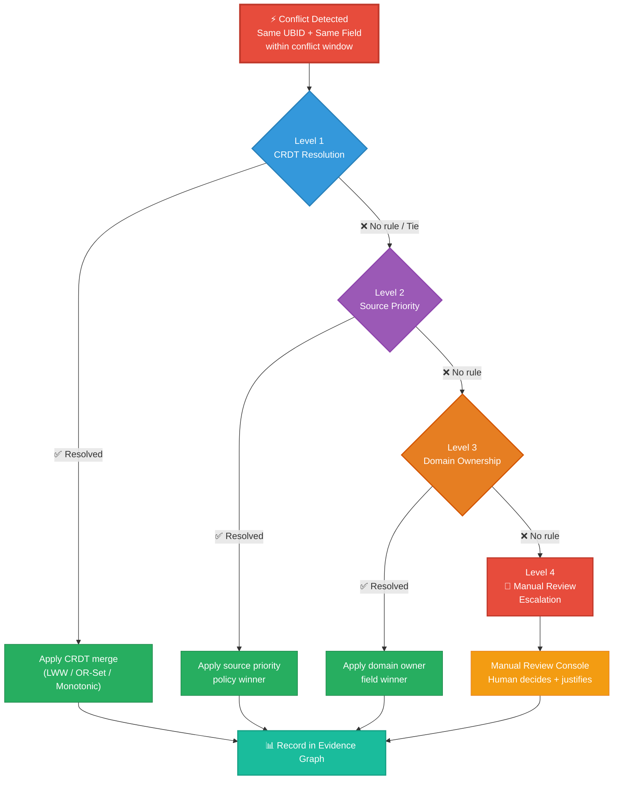
```mermaid
flowchart TB
    CONFLICT["⚡ Conflict Detected<br/>Same UBID + Same Field<br/>within conflict window"] --> L1

    L1{"Level 1<br/>CRDT Resolution"}
    L1 -->|"✅ Resolved"| R1["Apply CRDT merge<br/>(LWW / OR-Set / Monotonic)"]
    L1 -->|"❌ No rule / Tie"| L2

    L2{"Level 2<br/>Source Priority"}
    L2 -->|"✅ Resolved"| R2["Apply source priority<br/>policy winner"]
    L2 -->|"❌ No rule"| L3

    L3{"Level 3<br/>Domain Ownership"}
    L3 -->|"✅ Resolved"| R3["Apply domain owner<br/>field winner"]
    L3 -->|"❌ No rule"| L4

    L4["Level 4<br/>🧑 Manual Review<br/>Escalation"] --> MRC["Manual Review Console<br/>Human decides + justifies"]

    R1 --> AUDIT["📊 Record in Evidence Graph"]
    R2 --> AUDIT
    R3 --> AUDIT
    MRC --> AUDIT

    style CONFLICT fill:#e74c3c,stroke:#c0392b,color:#fff,stroke-width:3px
    style L1 fill:#3498db,stroke:#2980b9,color:#fff,stroke-width:2px
    style L2 fill:#9b59b6,stroke:#8e44ad,color:#fff,stroke-width:2px
    style L3 fill:#e67e22,stroke:#d35400,color:#fff,stroke-width:2px
    style L4 fill:#e74c3c,stroke:#c0392b,color:#fff,stroke-width:2px
    style R1 fill:#27ae60,stroke:#1e8449,color:#fff
    style R2 fill:#27ae60,stroke:#1e8449,color:#fff
    style R3 fill:#27ae60,stroke:#1e8449,color:#fff
    style MRC fill:#f39c12,stroke:#e67e22,color:#fff
    style AUDIT fill:#1abc9c,stroke:#16a085,color:#fff,stroke-width:2px
```

#### Level 1: CRDT-Based Deterministic Resolution

CRDTs (Conflict-free Replicated Data Types) are data structures that guarantee convergence under concurrent modification. Different field types use different CRDT strategies:

**Last-Write-Wins Register (LWW Register)**

Used for: scalar fields (address, name, date, status).

```
Merge rule: 
  If lamport_ts(A) > lamport_ts(B): value = A.new_value
  If lamport_ts(B) > lamport_ts(A): value = B.new_value
  If lamport_ts(A) == lamport_ts(B): tiebreak by source system priority hash

Guarantee: Commutative and idempotent. 
  merge(A, B) == merge(B, A)
  merge(A, merge(A, B)) == merge(A, B)
```

**Formal Property:** Given any set of concurrent updates to the same field, all replicas that apply the same set of updates will converge to the same final value, regardless of the order in which the updates are applied. This eliminates the possibility of divergent state across systems.

**OR-Set (Observed-Remove Set)**

Used for: set-valued fields (list of authorised signatories, list of business activities).

```
Operations:
  ADD(element, unique_tag): adds element with a unique tag
  REMOVE(element): removes all observed tags for that element

Merge rule:
  merged_set = union(all ADDs from both sides) - only REMOVE entries 
               whose tags were observed by the remover

Guarantee: Additions survive concurrent operations.
  If A adds "Priya" and B removes "Rajesh" concurrently,
  the merged set contains "Priya" and does not contain "Rajesh".
  
  If A adds "Priya" and B removes "Priya" concurrently,
  the merged set CONTAINS "Priya" because B's remove only affects
  the tags B had observed, not A's new tag.
```

**Why OR-Set, not Two-Phase Set:**

A Two-Phase Set (2P-Set) does not allow re-adding a removed element. This is unacceptable for signatory lists — a signatory removed in error must be re-addable. OR-Set allows re-addition because each ADD operation generates a new unique tag that is independent of previous REMOVE operations.

**Monotonic Merge (Counters and Timestamps)**

Used for: fields that should only move forward (employee_count, last_inspection_date).

```
Merge rule:
  merged_value = max(A.new_value, B.new_value)

Guarantee: The value never decreases.
  If A sets employee_count to 150 and B sets it to 145,
  the merged value is 150.
```

#### Level 2: Source Priority Policy

When CRDT resolution produces a tie (equal Lamport timestamps) or when the field type does not have a CRDT rule, the system consults the source priority policy.

```json
{
  "policy_id": "source-priority-v2.0.0",
  "rules": [
    {
      "field_pattern": "registered_address|business_name|establishment_date",
      "priority_order": ["SWS", "COMMERCIAL_TAXES", "FACTORIES", "SHOP_ESTABLISHMENT"],
      "rationale": "SWS is the primary registration system; its values for registration fields are authoritative"
    },
    {
      "field_pattern": "licence_status|licence_expiry",
      "priority_order": ["ISSUING_DEPARTMENT", "SWS"],
      "rationale": "The department that issues a licence is authoritative for its status"
    }
  ]
}
```

#### Level 3: Domain Ownership Policy

When a field does not have a source priority rule, the system checks if the field belongs to a specific department's domain.

```json
{
  "policy_id": "domain-ownership-v2.0.0",
  "rules": [
    {
      "field_pattern": "factory_licence_*",
      "owner": "FACTORIES",
      "rationale": "Factory licence fields are exclusively managed by the Factories department"
    },
    {
      "field_pattern": "shop_establishment_*",
      "owner": "SHOP_ESTABLISHMENT",
      "rationale": "Shop establishment fields are exclusively managed by the Shop Establishment department"
    }
  ]
}
```

#### Level 4: Manual Review Escalation

When no automated policy resolves the conflict, or when two policies themselves conflict, the event pair is escalated to the Manual Review Console.

```
Escalation criteria:
  1. No CRDT rule applies to this field type
  2. No source priority rule covers this field
  3. No domain ownership rule covers this field
  4. Two policies produce contradictory resolutions
  5. The field is marked as "requires human review" in the mapping

Escalation provides:
  - Both competing events (full payload)
  - The field name and both values
  - The source systems
  - All policies that were attempted and why they did not resolve
  - The full causal history of the field from the evidence graph
```

### Conflict Resolution Audit Trail

Every conflict resolution, at any level, produces an audit entry in the evidence graph:

```json
{
  "node_type": "CONFLICT_RESOLUTION",
  "conflict_id": "conf-20240315-001",
  "competing_events": ["evt-001", "evt-002"],
  "field": "registered_address",
  "ubid": "UBID-KA-2024-00000847",
  "resolution_level": "LEVEL_1_CRDT",
  "crdt_type": "LWW_REGISTER",
  "winning_event": "evt-001",
  "winning_value": "123 MG Road, Bengaluru",
  "losing_event": "evt-002",
  "losing_value": "456 Brigade Road, Bengaluru",
  "policy_version": "v2.0.0",
  "deterministic": true,
  "timestamp": "2024-03-15T10:04:25.123+05:30"
}
```

---

## Identity Resolution (UBID Handling)

### The UBID Challenge

UBID is Karnataka's universal business identifier. In the ideal case, every business has exactly one UBID that is consistent across all systems. In practice, UBID resolution faces several challenges:

1. **Pre-UBID registrations:** Businesses registered before UBID was mandated may have inconsistent or missing UBIDs
2. **Multi-entry registration:** Businesses that registered through multiple systems may have been assigned different UBIDs
3. **Transcription errors:** Manual UBID entry in legacy systems introduces typos
4. **Delayed propagation:** New UBIDs may not have reached all systems yet
5. **Similar entities:** Businesses with similar names at the same address may be confused

### Three-State Confidence Model

Every UBID resolution produces one of three confidence states:

| State | Confidence Score | Behaviour | Rationale |
|---|---|---|---|
| **High Confidence** | ≥ 0.95 | Normal propagation proceeds immediately | UBID matches unambiguously across all verification criteria |
| **Probation** | 0.70 – 0.94 | Propagation proceeds with `ubid_verified: false` flag; event queued for background verification | UBID match is likely correct but has minor discrepancies (e.g., slight name variation) |
| **Quarantine** | < 0.70 | Propagation is halted; event is routed to Manual Review Console | UBID match is unreliable; risk of propagating to wrong entity is unacceptable |

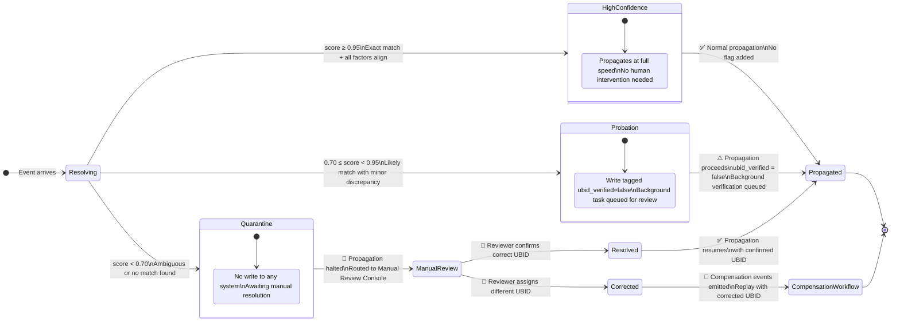
```mermaid
stateDiagram-v2
    direction LR

    [*] --> Resolving : Event arrives

    Resolving --> HighConfidence : score ≥ 0.95\nExact match + all factors align
    Resolving --> Probation : 0.70 ≤ score < 0.95\nLikely match with minor discrepancy
    Resolving --> Quarantine : score < 0.70\nAmbiguous or no match found

    HighConfidence --> Propagated : ✅ Normal propagation\nNo flag added
    Probation --> Propagated : ⚠️ Propagation proceeds\nubid_verified = false\nBackground verification queued
    Quarantine --> ManualReview : 🚫 Propagation halted\nRouted to Manual Review Console

    ManualReview --> Resolved : 👤 Reviewer confirms correct UBID
    ManualReview --> Corrected : 👤 Reviewer assigns different UBID

    Resolved --> Propagated : ✅ Propagation resumes\nwith confirmed UBID
    Corrected --> CompensationWorkflow : 🔄 Compensation events emitted\nReplay with corrected UBID

    Propagated --> [*]
    CompensationWorkflow --> [*]

    state HighConfidence {
        [*] --> Live
        Live : Propagates at full speed\nNo human intervention needed
    }
    state Probation {
        [*] --> FlaggedWrite
        FlaggedWrite : Write tagged ubid_verified=false\nBackground task queued for review
    }
    state Quarantine {
        [*] --> Blocked
        Blocked : No write to any system\nAwaiting manual resolution
    }
```

### Resolution Algorithm

```python
def resolve_ubid(raw_change: RawChange) -> UBIDResolution:
    """
    Resolve the UBID for a raw change event.
    
    Uses a multi-factor scoring model that considers:
    1. Exact UBID match in the UBID registry
    2. Business name similarity (Jaro-Winkler distance)
    3. Address similarity
    4. Registration date proximity
    5. Cross-system UBID consistency
    """
    
    # Step 1: Exact UBID lookup
    ubid_candidate = ubid_registry.lookup(raw_change.entity_id)
    
    if ubid_candidate is None:
        # No UBID found — attempt fuzzy matching
        candidates = ubid_registry.fuzzy_search(
            name=raw_change.business_name,
            address=raw_change.address,
            source_system=raw_change.source_system
        )
        
        if len(candidates) == 0:
            return UBIDResolution(
                state=QUARANTINE,
                confidence=0.0,
                reason="No matching UBID found in registry"
            )
        
        ubid_candidate = candidates[0]  # Highest scoring candidate
    
    # Step 2: Multi-factor confidence scoring
    score = 0.0
    score += exact_ubid_match_score(ubid_candidate, raw_change)     # 0.0 - 0.40
    score += name_similarity_score(ubid_candidate, raw_change)      # 0.0 - 0.25
    score += address_similarity_score(ubid_candidate, raw_change)   # 0.0 - 0.20
    score += cross_system_consistency_score(ubid_candidate)         # 0.0 - 0.15
    
    # Step 3: Assign confidence state
    if score >= 0.95:
        state = HIGH_CONFIDENCE
    elif score >= 0.70:
        state = PROBATION
    else:
        state = QUARANTINE
    
    return UBIDResolution(
        ubid=ubid_candidate.ubid,
        state=state,
        confidence=score,
        scoring_breakdown={...},
        timestamp=lamport_clock.tick()
    )
```

### UBID Correction and Compensation

When a UBID assignment is later determined to be incorrect (e.g., a manual reviewer identifies that an event was matched to the wrong business), the system initiates a correction workflow:

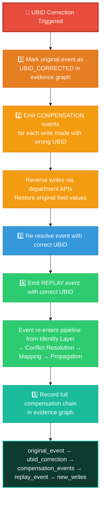
```mermaid
flowchart TB
    A["🚨 UBID Correction Triggered"] --> B["1️⃣ Mark original event as<br/>UBID_CORRECTED in evidence graph"]
    B --> C["2️⃣ Emit COMPENSATION events<br/>for each write made with wrong UBID"]
    C --> C1["Reverse writes via department APIs<br/>Restore original field values"]
    C1 --> D["3️⃣ Re-resolve event with correct UBID"]
    D --> E["4️⃣ Emit REPLAY event with correct UBID"]
    E --> E1["Event re-enters pipeline from Identity Layer<br/>→ Conflict Resolution → Mapping → Propagation"]
    E1 --> F["5️⃣ Record full compensation chain<br/>in evidence graph"]

    F --> G["original_event → ubid_correction →<br/>compensation_events → replay_event → new_writes"]

    style A fill:#e74c3c,stroke:#c0392b,color:#fff,stroke-width:3px
    style B fill:#e67e22,stroke:#d35400,color:#fff
    style C fill:#f39c12,stroke:#e67e22,color:#fff
    style C1 fill:#f39c12,stroke:#e67e22,color:#fff
    style D fill:#3498db,stroke:#2980b9,color:#fff
    style E fill:#2ecc71,stroke:#27ae60,color:#fff
    style E1 fill:#2ecc71,stroke:#27ae60,color:#fff
    style F fill:#1abc9c,stroke:#16a085,color:#fff
    style G fill:#0d3b2e,stroke:#1abc9c,color:#fff,stroke-width:2px
```

**Compensation Events:**

```json
{
  "event_type": "COMPENSATION",
  "compensating_for": "evt-001",
  "reason": "UBID_CORRECTION",
  "original_ubid": "UBID-KA-2024-00000847",
  "corrected_ubid": "UBID-KA-2024-00000923",
  "compensation_actions": [
    {
      "target_system": "FACTORIES",
      "action": "RESTORE_FIELD",
      "field": "registered_address",
      "restore_to_value": "789 Industrial Area, Bengaluru",
      "incorrectly_set_value": "123 MG Road, Bengaluru"
    }
  ]
}
```

---

## Change Detection Strategy

### Tiered Detection Model

Every department system is categorised into one of three tiers based on its integration capabilities. The tier determines which change detection method is used. Critically, **all tiers produce identical canonical events** — the rest of the fabric does not know or care how a change was detected.

### Tier 1: Webhook / Event-Driven

**Method:** The system natively emits events (webhooks, event streams, pub/sub notifications) when data changes.

**Implementation:**
- Register a webhook endpoint with the source system
- Receive change notifications in real-time
- Parse the notification payload into a RawChange
- Acknowledge receipt to the source system

**Latency:** < 1 second from change to canonical event

**Reliability:**
- Webhook endpoints are load-balanced and highly available
- If the webhook fails to deliver, the source system's retry mechanism will re-send
- Connector maintains a delivery log to detect missed webhooks via gap detection

**Used for:** Modern systems with native event capability (estimated 5–8 of Karnataka's department systems)

### Tier 2: API Polling / CDC

**Method A — API Polling:**
The connector periodically queries the system's REST API for changes since the last poll.

```
GET /api/v1/registrations?modified_since=2024-03-15T10:00:00Z
Authorization: Bearer {service_token}
```

**Polling frequency:** Configurable per system, typically 5–30 seconds.

**Method B — CDC (Change Data Capture):**
For systems with accessible databases (PostgreSQL, MySQL, Oracle), Debezium captures row-level changes directly from the database transaction log (WAL/binlog).

```json
{
  "source": {
    "connector": "postgresql",
    "db": "factories_db",
    "schema": "public",
    "table": "business_registrations"
  },
  "op": "u",
  "before": { "signatory": "Rajesh Kumar" },
  "after": { "signatory": "Priya Sharma" },
  "ts_ms": 1710487463456
}
```

**Latency:** 1–30 seconds from change to canonical event

**Used for:** Semi-modern systems with REST APIs or accessible databases (estimated 10–15 systems)

### Tier 3: Snapshot Diff

**Method:** Periodically capture a full or partial snapshot of the system's data and compare it against the previous snapshot to detect changes.

**Algorithm:**

```python
def snapshot_diff(system_id: str) -> list[RawChange]:
    """
    Detect changes by comparing two snapshots of the system's data.
    
    1. Retrieve current snapshot (via bulk API, screen scraping, or data export)
    2. Load previous snapshot from local store
    3. Compute field-level diff for each record
    4. Emit RawChange for each detected field change
    5. Store current snapshot as the new baseline
    """
    
    current_snapshot = retrieve_snapshot(system_id)
    previous_snapshot = load_previous_snapshot(system_id)
    
    changes = []
    
    for record_id in union(current_snapshot.keys(), previous_snapshot.keys()):
        current = current_snapshot.get(record_id)
        previous = previous_snapshot.get(record_id)
        
        if current is None:
            # Record deleted (rare in government systems)
            changes.append(RawChange(type=ENTITY_DELETE, ...))
        elif previous is None:
            # New record
            changes.append(RawChange(type=ENTITY_CREATE, ...))
        else:
            # Existing record — check each field
            for field in union(current.keys(), previous.keys()):
                if current.get(field) != previous.get(field):
                    changes.append(RawChange(
                        type=FIELD_UPDATE,
                        field_name=field,
                        old_value=previous.get(field),
                        new_value=current.get(field),
                        ...
                    ))
    
    store_snapshot(system_id, current_snapshot)
    return changes
```

**Latency:** 1–15 minutes from change to canonical event (depends on snapshot frequency)

**Reliability:**
- Snapshot comparison is deterministic — it will always detect every change that persists between snapshots
- Transient changes (set and reverted between snapshots) are invisible. This is acceptable because the net effect is no change.

**Used for:** Fully legacy systems with opaque APIs (estimated 15–20+ systems)

### Tier Comparison

| Factor | Tier 1 (Webhook) | Tier 2 (Polling/CDC) | Tier 3 (Snapshot Diff) |
|---|---|---|---|
| Latency | < 1 second | 1–30 seconds | 1–15 minutes |
| System cooperation required | High (event registration) | Medium (API access or DB access) | Low (any data access method) |
| Missed change risk | Low (with gap detection) | Very low (CDC captures all WAL entries) | None (full comparison) |
| System load impact | None (push-based) | Low to medium (polling frequency-dependent) | Medium to high (full snapshot retrieval) |
| Transient change visibility | Yes | Yes (CDC) / No (polling with gaps) | No |

---

## Propagation & Execution Model (Saga)

### Why Not Distributed Transactions?

Distributed transactions (two-phase commit, XA) are impossible across heterogeneous systems that:
- Cannot be modified to participate in a transaction coordinator
- Have different availability characteristics
- May be offline for maintenance windows
- Use different database technologies

UBID Fabric uses the **saga pattern** instead: each write to a department system is an independent step. Steps succeed or fail independently. Failed steps are retried, dead-lettered, or compensated.

### Saga Structure

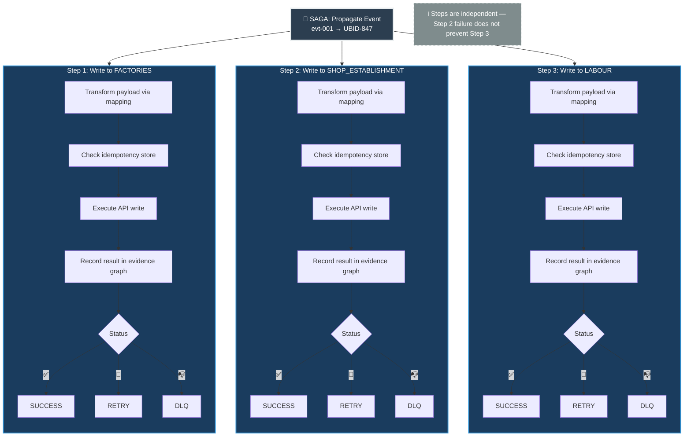
```mermaid
flowchart TB
    EVT["📨 SAGA: Propagate Event<br/>evt-001 → UBID-847"] --> S1 & S2 & S3

    subgraph S1["Step 1: Write to FACTORIES"]
        direction TB
        S1A["Transform payload via mapping"] --> S1B["Check idempotency store"]
        S1B --> S1C["Execute API write"]
        S1C --> S1D["Record result in evidence graph"]
        S1D --> S1E{"Status"}
        S1E -->|"✅"| S1F["SUCCESS"]
        S1E -->|"🔄"| S1G["RETRY"]
        S1E -->|"📭"| S1H["DLQ"]
    end

    subgraph S2["Step 2: Write to SHOP_ESTABLISHMENT"]
        direction TB
        S2A["Transform payload via mapping"] --> S2B["Check idempotency store"]
        S2B --> S2C["Execute API write"]
        S2C --> S2D["Record result in evidence graph"]
        S2D --> S2E{"Status"}
        S2E -->|"✅"| S2F["SUCCESS"]
        S2E -->|"🔄"| S2G["RETRY"]
        S2E -->|"📭"| S2H["DLQ"]
    end

    subgraph S3["Step 3: Write to LABOUR"]
        direction TB
        S3A["Transform payload via mapping"] --> S3B["Check idempotency store"]
        S3B --> S3C["Execute API write"]
        S3C --> S3D["Record result in evidence graph"]
        S3D --> S3E{"Status"}
        S3E -->|"✅"| S3F["SUCCESS"]
        S3E -->|"🔄"| S3G["RETRY"]
        S3E -->|"📭"| S3H["DLQ"]
    end

    NOTE["ℹ️ Steps are independent — Step 2 failure does not prevent Step 3"]

    style EVT fill:#2c3e50,stroke:#ecf0f1,color:#fff,stroke-width:3px
    style S1 fill:#1a3c5e,stroke:#3498db,color:#fff,stroke-width:2px
    style S2 fill:#1a3c5e,stroke:#3498db,color:#fff,stroke-width:2px
    style S3 fill:#1a3c5e,stroke:#3498db,color:#fff,stroke-width:2px
    style NOTE fill:#7f8c8d,stroke:#95a5a6,color:#fff,stroke-dasharray:5 5
```

### Saga Execution via Temporal.io

Each saga is implemented as a Temporal workflow:

```python
@workflow.defn
class PropagationSaga:
    """
    Saga workflow for propagating a canonical event to all target systems.
    
    Each target system write is an independent activity.
    Activities retry with exponential backoff.
    Failed activities are dead-lettered after max retries.
    Compensation activities reverse writes when needed.
    """
    
    @workflow.run
    async def run(self, event: CanonicalEvent, targets: list[str]):
        results = {}
        
        for target in targets:
            try:
                result = await workflow.execute_activity(
                    write_to_target,
                    args=[event, target],
                    start_to_close_timeout=timedelta(seconds=30),
                    retry_policy=RetryPolicy(
                        initial_interval=timedelta(seconds=1),
                        backoff_coefficient=2.0,
                        maximum_interval=timedelta(minutes=5),
                        maximum_attempts=5,
                        non_retryable_error_types=["SchemaValidationError"]
                    )
                )
                results[target] = {"status": "SUCCESS", "write_id": result.write_id}
                
            except ActivityError as e:
                # Max retries exhausted — dead-letter this step
                await workflow.execute_activity(
                    dead_letter_event,
                    args=[event, target, str(e)],
                    start_to_close_timeout=timedelta(seconds=10)
                )
                results[target] = {"status": "DLQ", "error": str(e)}
        
        # Record saga completion in evidence graph
        await workflow.execute_activity(
            record_saga_completion,
            args=[event.event_id, results],
            start_to_close_timeout=timedelta(seconds=10)
        )
        
        return results
```

### Compensation Workflow

```python
@workflow.defn
class CompensationSaga:
    """
    Compensation workflow for reversing writes made with incorrect data.
    
    Triggered when:
    1. UBID correction: writes were made to the wrong entity
    2. Mapping error: field transformation produced incorrect values
    3. Manual override: reviewer reverses a previous propagation
    """
    
    @workflow.run
    async def run(self, compensation: CompensationRequest):
        for action in compensation.actions:
            try:
                await workflow.execute_activity(
                    reverse_write,
                    args=[action.target_system, action.field, 
                          action.restore_to_value],
                    start_to_close_timeout=timedelta(seconds=30),
                    retry_policy=RetryPolicy(maximum_attempts=10)
                )
            except ActivityError:
                # Compensation failure is a critical alert
                await workflow.execute_activity(
                    raise_critical_alert,
                    args=[compensation, action],
                    start_to_close_timeout=timedelta(seconds=10)
                )
```

---

## Idempotency Design

### The Idempotency Problem

In a distributed system with at-least-once delivery guarantees, the same event may be delivered to any component more than once. Without idempotency, this causes duplicate writes:

```
Event evt-001 delivered → Write to FACTORIES → Address updated to "123 MG Road"
Event evt-001 delivered again (retry/duplicate) → Write to FACTORIES → Address updated to "123 MG Road" again

Without idempotency: Two API calls, two audit entries, potential side effects
With idempotency: Second delivery is a silent no-op
```

### Idempotency Store Design

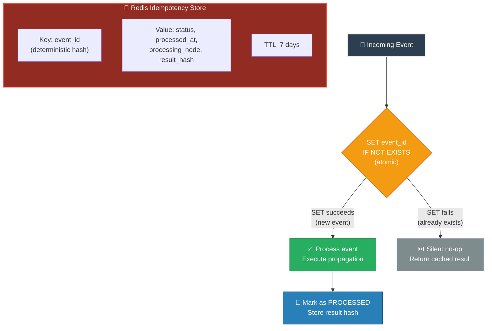
```mermaid
flowchart TB
    subgraph REDIS["🔑 Redis Idempotency Store"]
        direction TB
        KEY["Key: event_id<br/>(deterministic hash)"]
        VAL["Value: status, processed_at,<br/>processing_node, result_hash"]
        TTL["TTL: 7 days"]
    end

    EVENT["📨 Incoming Event"] --> CHECK{"SET event_id<br/>IF NOT EXISTS<br/>(atomic)"}

    CHECK -->|"SET succeeds<br/>(new event)"| PROCESS["✅ Process event<br/>Execute propagation"]
    CHECK -->|"SET fails<br/>(already exists)"| SKIP["⏭️ Silent no-op<br/>Return cached result"]

    PROCESS --> MARK["📝 Mark as PROCESSED<br/>Store result hash"]

    style REDIS fill:#922b21,stroke:#e74c3c,color:#fff,stroke-width:2px
    style EVENT fill:#2c3e50,stroke:#ecf0f1,color:#fff,stroke-width:2px
    style CHECK fill:#f39c12,stroke:#e67e22,color:#fff,stroke-width:2px
    style PROCESS fill:#27ae60,stroke:#1e8449,color:#fff
    style SKIP fill:#7f8c8d,stroke:#95a5a6,color:#fff
    style MARK fill:#2980b9,stroke:#1a5276,color:#fff
```

### Processing Flow

```python
def process_event(event: CanonicalEvent) -> ProcessingResult:
    """
    Process a canonical event with idempotency guarantee.
    
    Uses Redis SET NX (set if not exists) for atomic 
    check-and-claim. This prevents race conditions when
    the same event is delivered to multiple processing nodes
    simultaneously.
    """
    
    # Atomic check-and-claim
    claimed = redis.set(
        key=f"idem:{event.event_id}",
        value=json.dumps({
            "status": "IN_PROGRESS",
            "claimed_at": now(),
            "node": node_id
        }),
        nx=True,  # Only set if key does not exist
        ex=86400  # Expire after 24 hours (safety net)
    )
    
    if not claimed:
        # Event already processed or in progress
        existing = redis.get(f"idem:{event.event_id}")
        if existing["status"] == "PROCESSED":
            return ProcessingResult(status="DUPLICATE", cached=True)
        elif existing["status"] == "IN_PROGRESS":
            # Another node is processing — wait briefly, then check again
            return ProcessingResult(status="DEFERRED")
    
    try:
        # Process the event
        result = execute_propagation(event)
        
        # Mark as processed
        redis.set(
            key=f"idem:{event.event_id}",
            value=json.dumps({
                "status": "PROCESSED",
                "processed_at": now(),
                "node": node_id,
                "result_hash": hash(result)
            }),
            ex=604800  # TTL: 7 days
        )
        
        return result
        
    except Exception as e:
        # Remove claim so event can be retried
        redis.delete(f"idem:{event.event_id}")
        raise
```

---

## Audit & Observability (Evidence Graph)

### Why Not Flat Logs?

Flat logs (structured or unstructured) answer "what happened at time T." They do not answer:

- "Why is this field set to this value right now?"
- "What would have happened if event X had not occurred?"
- "Which events were affected by UBID correction Y?"
- "Show me the full chain of events from citizen request to final write"

These questions require **causal traversal**, not sequential search. The evidence graph provides this.

### Graph Structure

**Node Type Legend:**


```mermaid
graph LR
    CE["📨 CANONICAL_EVENT"] --- UR["🔍 UBID_RESOLUTION"]
    UR --- ST["🗺️ SCHEMA_TRANSLATION"]
    ST --- CD["⚡ CONFLICT_DETECTION"]
    CD --- CR["⚖️ CONFLICT_RESOLUTION"]
    CR --- PW["✍️ PROPAGATION_WRITE"]
    PW --- WC["✅ WRITE_CONFIRMATION"]
    WC --- WF["❌ WRITE_FAILURE"]
    WF --- RT["🔄 RETRY"]
    RT --- DL["📭 DLQ_ENTRY"]
    DL --- CO["↩️ COMPENSATION"]
    CO --- RP["🔁 REPLAY"]
    RP --- MD["👤 MANUAL_DECISION"]
    MD --- RC["🔎 RECONCILIATION_CHECK"]

    style CE fill:#3498db,stroke:#2980b9,color:#fff
    style UR fill:#e67e22,stroke:#d35400,color:#fff
    style ST fill:#9b59b6,stroke:#8e44ad,color:#fff
    style CD fill:#e74c3c,stroke:#c0392b,color:#fff
    style CR fill:#27ae60,stroke:#1e8449,color:#fff
    style PW fill:#2980b9,stroke:#1a5276,color:#fff
    style WC fill:#27ae60,stroke:#1e8449,color:#fff
    style WF fill:#c0392b,stroke:#922b21,color:#fff
    style RT fill:#f39c12,stroke:#e67e22,color:#fff
    style DL fill:#7f8c8d,stroke:#566573,color:#fff
    style CO fill:#e74c3c,stroke:#c0392b,color:#fff
    style RP fill:#1abc9c,stroke:#16a085,color:#fff
    style MD fill:#f39c12,stroke:#e67e22,color:#fff
    style RC fill:#2ecc71,stroke:#27ae60,color:#fff
```

**Sample Causal Chain — Happy Path (address update, no conflict):**

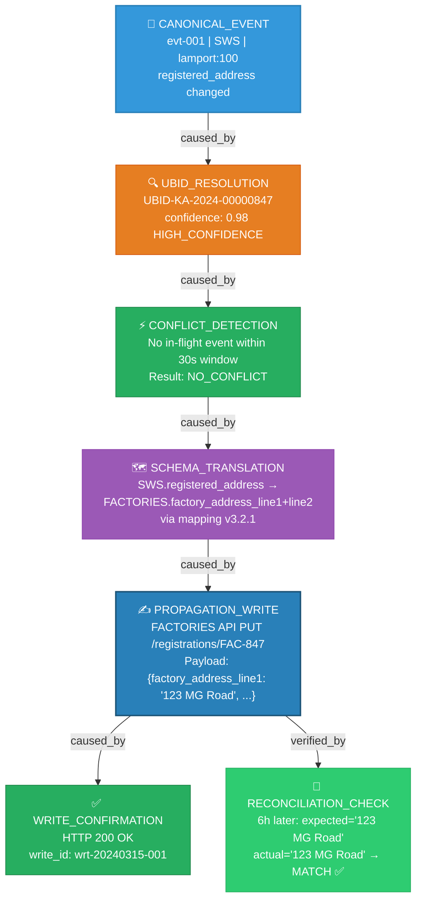
```mermaid
graph TB
    A["📨 CANONICAL_EVENT\nevt-001 | SWS | lamport:100\nregistered_address changed"]
    B["🔍 UBID_RESOLUTION\nUBID-KA-2024-00000847\nconfidence: 0.98 HIGH_CONFIDENCE"]
    C["⚡ CONFLICT_DETECTION\nNo in-flight event within 30s window\nResult: NO_CONFLICT"]
    D["🗺️ SCHEMA_TRANSLATION\nSWS.registered_address →\nFACTORIES.factory_address_line1+line2\nvia mapping v3.2.1"]
    E["✍️ PROPAGATION_WRITE\nFACTORIES API PUT /registrations/FAC-847\nPayload: {factory_address_line1: '123 MG Road', ...}"]
    F["✅ WRITE_CONFIRMATION\nHTTP 200 OK\nwrite_id: wrt-20240315-001"]
    G["🔎 RECONCILIATION_CHECK\n6h later: expected='123 MG Road'\nactual='123 MG Road' → MATCH ✅"]

    A -->|"caused_by"| B
    B -->|"caused_by"| C
    C -->|"caused_by"| D
    D -->|"caused_by"| E
    E -->|"caused_by"| F
    E -->|"verified_by"| G

    style A fill:#3498db,stroke:#2980b9,color:#fff,stroke-width:2px
    style B fill:#e67e22,stroke:#d35400,color:#fff
    style C fill:#27ae60,stroke:#1e8449,color:#fff
    style D fill:#9b59b6,stroke:#8e44ad,color:#fff
    style E fill:#2980b9,stroke:#1a5276,color:#fff,stroke-width:2px
    style F fill:#27ae60,stroke:#1e8449,color:#fff
    style G fill:#2ecc71,stroke:#27ae60,color:#fff
```

**Sample Causal Chain — Failure Path (write failure → DLQ):**

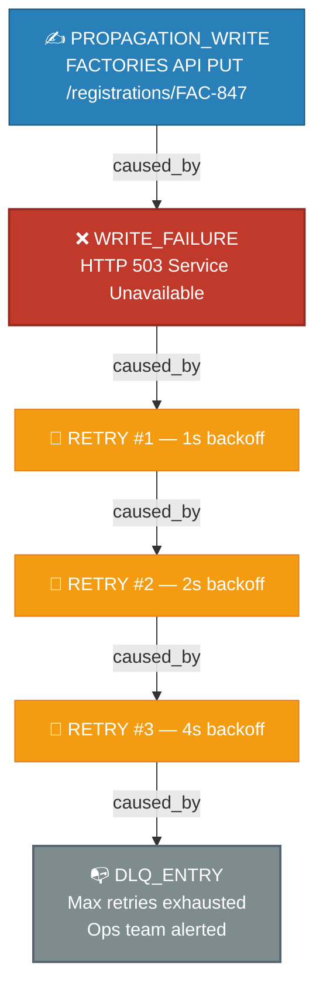
```mermaid
graph TB
    E2["✍️ PROPAGATION_WRITE\nFACTORIES API PUT /registrations/FAC-847"]
    F2["❌ WRITE_FAILURE\nHTTP 503 Service Unavailable"]
    R1["🔄 RETRY #1 — 1s backoff"]
    R2["🔄 RETRY #2 — 2s backoff"]
    R3["🔄 RETRY #3 — 4s backoff"]
    DLQ["📭 DLQ_ENTRY\nMax retries exhausted\nOps team alerted"]

    E2 -->|"caused_by"| F2
    F2 -->|"caused_by"| R1
    R1 -->|"caused_by"| R2
    R2 -->|"caused_by"| R3
    R3 -->|"caused_by"| DLQ

    style E2 fill:#2980b9,stroke:#1a5276,color:#fff
    style F2 fill:#c0392b,stroke:#922b21,color:#fff,stroke-width:2px
    style R1 fill:#f39c12,stroke:#e67e22,color:#fff
    style R2 fill:#f39c12,stroke:#e67e22,color:#fff
    style R3 fill:#f39c12,stroke:#e67e22,color:#fff
    style DLQ fill:#7f8c8d,stroke:#566573,color:#fff,stroke-width:2px
```

**Node Types:**

| Node Type | Description | Example |
|---|---|---|
| `CANONICAL_EVENT` | An immutable event captured from a source system | "Registered address changed to 123 MG Road" |
| `UBID_RESOLUTION` | A UBID resolution decision with confidence state | "Resolved to UBID-847 with HIGH_CONFIDENCE (0.97)" |
| `SCHEMA_TRANSLATION` | A field mapping transformation | "SWS.registered_address → FACTORIES.factory_address_line1 via SPLIT_ADDRESS_LINE_1" |
| `CONFLICT_DETECTION` | Detection of concurrent updates to the same field | "Two events for UBID-847.registered_address within 3 seconds" |
| `CONFLICT_RESOLUTION` | Resolution decision with winning and losing values | "LWW_REGISTER: SWS value wins (higher Lamport timestamp)" |
| `PROPAGATION_WRITE` | An actual write made to a target system | "FACTORIES.factory_address_line1 set to '123 MG Road'" |
| `WRITE_CONFIRMATION` | Confirmation that a write was accepted by the target | "FACTORIES API returned 200 OK" |
| `WRITE_FAILURE` | A failed write attempt | "FACTORIES API returned 503 Service Unavailable" |
| `RETRY` | A retry attempt for a failed write | "Retry #3 after 8-second backoff" |
| `DLQ_ENTRY` | An event moved to the dead-letter queue | "Moved to DLQ after 5 failed retries" |
| `COMPENSATION` | A compensating action that reverses a previous write | "Restored FACTORIES.factory_address_line1 to '789 Industrial Area'" |
| `REPLAY` | A replayed event after correction | "Event replayed with corrected UBID-923" |
| `MANUAL_DECISION` | A human reviewer's decision | "Reviewer approved SWS value based on registration certificate" |
| `RECONCILIATION_CHECK` | A scheduled reconciliation comparison | "Expected: '123 MG Road', Actual: '123 MG Road' — MATCH" |
| `RECONCILIATION_DRIFT` | Detected drift between expected and actual state | "Expected: '123 MG Road', Actual: '456 Brigade Road' — DRIFT DETECTED" |

**Edge Types:**

| Edge Type | Meaning | Example |
|---|---|---|
| `caused_by` | Node B was caused by node A | Write was caused by canonical event |
| `resolved_by` | Conflict A was resolved by decision B | Conflict resolved by LWW_REGISTER rule |
| `superseded_by` | Event A was superseded by event B | Old address event superseded by newer one |
| `compensated_by` | Write A was compensated (reversed) by compensation B | Incorrect write compensated by UBID correction |
| `replayed_as` | Event A was replayed as event B | Original event replayed with corrected UBID |
| `translated_via` | Event A was translated using mapping B | Event translated via mapping v3.2.1 |
| `escalated_to` | Conflict A was escalated to manual review B | Unresolvable conflict escalated to reviewer |
| `verified_by` | Write A was verified by reconciliation check B | Write confirmed by reconciliation run |

### Graph Query Examples

**Query 1: "Why is FACTORIES.factory_address_line1 set to '123 MG Road' for UBID-847?"**

```
TRAVERSE from node(PROPAGATION_WRITE, target=FACTORIES, field=factory_address_line1, ubid=UBID-847)
  ← caused_by → node(CONFLICT_RESOLUTION)
  ← resolved_by → node(CONFLICT_DETECTION)  
  ← caused_by → node(CANONICAL_EVENT, source=SWS)
  
RESULT: 
  Field was set by propagation of SWS canonical event evt-001,
  which won a LWW conflict against SHOP_ESTABLISHMENT event evt-002.
  SWS value had higher Lamport timestamp (100 > 98).
  Policy version: v2.0.0.
```

**Query 2: "Show me all writes affected by UBID correction cor-003"**

```
TRAVERSE from node(UBID_CORRECTION, id=cor-003)
  → compensated_by → node(COMPENSATION, ...)
  → caused_by → node(PROPAGATION_WRITE, ...)
  
  → replayed_as → node(REPLAY, ...)
  → caused_by → node(PROPAGATION_WRITE, ...)
  
RESULT:
  UBID correction cor-003 reversed 3 writes (FACTORIES, SHOP_ESTABLISHMENT, LABOUR)
  and replayed the event with corrected UBID-923, producing 3 new writes.
```

### Storage Implementation

The evidence graph is stored in PostgreSQL using a node-edge table model:

```sql
CREATE TABLE evidence_nodes (
    node_id         UUID PRIMARY KEY DEFAULT gen_random_uuid(),
    node_type       VARCHAR(50) NOT NULL,
    ubid            VARCHAR(50),
    event_id        VARCHAR(64),
    timestamp       TIMESTAMPTZ NOT NULL DEFAULT NOW(),
    payload         JSONB NOT NULL,
    
    INDEX idx_nodes_ubid (ubid),
    INDEX idx_nodes_event_id (event_id),
    INDEX idx_nodes_type_ts (node_type, timestamp)
);

CREATE TABLE evidence_edges (
    edge_id         UUID PRIMARY KEY DEFAULT gen_random_uuid(),
    from_node_id    UUID NOT NULL REFERENCES evidence_nodes(node_id),
    to_node_id      UUID NOT NULL REFERENCES evidence_nodes(node_id),
    edge_type       VARCHAR(30) NOT NULL,
    metadata        JSONB,
    
    INDEX idx_edges_from (from_node_id),
    INDEX idx_edges_to (to_node_id),
    INDEX idx_edges_type (edge_type)
);
```

---

## Reconciliation Engine

### Purpose

The reconciliation engine is the system's final safety net. It operates on the principle of **trust but verify**: even after successful propagation confirms that a write was accepted, the reconciliation engine periodically checks that the write is still in effect and has not been overwritten by an out-of-band change.

### How It Works

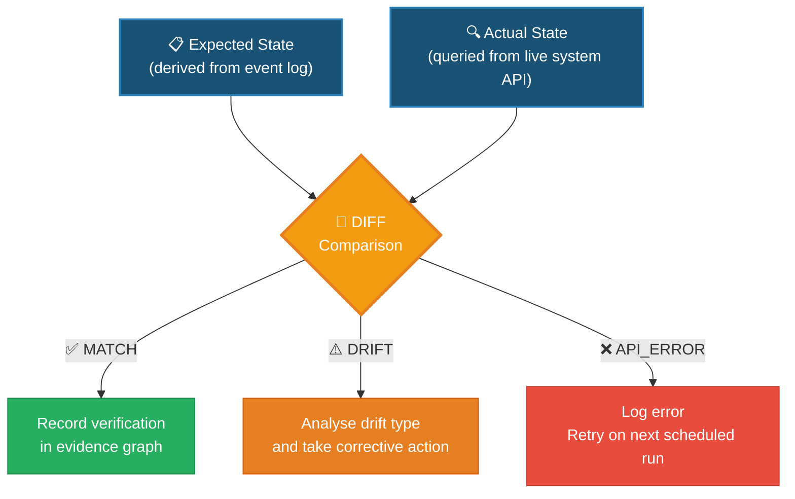
```mermaid
flowchart TB
    ES["📋 Expected State<br/>(derived from event log)"] --> DIFF
    AS["🔍 Actual State<br/>(queried from live system API)"] --> DIFF

    DIFF{"🔎 DIFF<br/>Comparison"}

    DIFF -->|"✅ MATCH"| MATCH["Record verification<br/>in evidence graph"]
    DIFF -->|"⚠️ DRIFT"| DRIFT["Analyse drift type<br/>and take corrective action"]
    DIFF -->|"❌ API_ERROR"| ERR["Log error<br/>Retry on next scheduled run"]

    style ES fill:#1a5276,stroke:#2980b9,color:#fff,stroke-width:2px
    style AS fill:#1a5276,stroke:#2980b9,color:#fff,stroke-width:2px
    style DIFF fill:#f39c12,stroke:#e67e22,color:#fff,stroke-width:3px
    style MATCH fill:#27ae60,stroke:#1e8449,color:#fff
    style DRIFT fill:#e67e22,stroke:#d35400,color:#fff
    style ERR fill:#e74c3c,stroke:#c0392b,color:#fff
```

### Expected State Derivation

The reconciliation engine derives the expected state by replaying all canonical events for a given UBID through the conflict resolution and schema mapping layers:

```
Expected state for UBID-847 in FACTORIES:
  1. Replay all events for UBID-847 in lamport_timestamp order
  2. Apply CRDT conflict resolution for concurrent events
  3. Apply schema mapping (SWS → FACTORIES)
  4. Result: expected field values for FACTORIES system
```

### Drift Classification

| Drift Type | Description | Action |
|---|---|---|
| **Stale value** | Expected value is newer than actual value — a propagation was missed or failed | Auto-repair: re-propagate the expected value |
| **Out-of-band update** | Actual value differs from expected value and is not in the event log — someone changed the value directly in the department system without the fabric detecting it | Ingest the actual value as a new canonical event (snapshot diff) and re-process |
| **Partial propagation** | Some target systems have the expected value but others do not | Auto-repair: re-propagate to the systems that are behind |
| **Ambiguous drift** | Both expected and actual values differ from the last known good state | Escalate to Manual Review Console |

### Schedule

```json
{
  "reconciliation_schedule": [
    {
      "target_system": "FACTORIES",
      "frequency": "every_6_hours",
      "scope": "records_modified_since_last_run",
      "full_scan_frequency": "weekly"
    },
    {
      "target_system": "SHOP_ESTABLISHMENT",
      "frequency": "every_4_hours",
      "scope": "records_modified_since_last_run",
      "full_scan_frequency": "weekly"
    },
    {
      "target_system": "LABOUR",
      "frequency": "every_12_hours",
      "scope": "records_modified_since_last_run",
      "full_scan_frequency": "monthly"
    }
  ]
}
```

---

## Failure Handling & Edge Cases

### Failure Matrix

| Failure Mode | Detection | Response | Recovery |
|---|---|---|---|
| **API timeout** | HTTP timeout (configurable, default 30s) | Retry with exponential backoff (1s, 2s, 4s, 8s, 16s) | Auto-retry up to 5 times, then DLQ |
| **API error (4xx)** | HTTP 4xx response | Log error details; if 400 (validation), quarantine event for mapping review; if 401/403, alert for credential refresh | Mapping review for 400; credential update for 401/403 |
| **API error (5xx)** | HTTP 5xx response | Retry with exponential backoff | Auto-retry up to 5 times, then DLQ |
| **Duplicate event** | Idempotency store lookup | Silent no-op — no processing, no side effects | N/A — handled automatically |
| **Schema drift** | Change Capture Layer validation failure | Quarantine event, raise schema drift alert | Update schema mapping registration, replay quarantined events |
| **Partial propagation** | Saga step failure tracking | Continue remaining steps, DLQ failed step | Reconciliation engine detects and repairs |
| **UBID mismatch** | Manual review or cross-system verification | Compensation events for incorrect writes, replay with correct UBID | Full compensation + replay workflow |
| **Kafka unavailable** | Connection failure | Connector buffers events locally (bounded queue) | Flush buffer when Kafka recovers |
| **Redis unavailable** | Connection failure | Fall back to PostgreSQL-based idempotency check (higher latency) | Automatic failover; Redis recovery restores performance |
| **Temporal unavailable** | Workflow creation failure | Events buffered in Kafka; sagas created when Temporal recovers | Temporal's durable execution resumes in-progress workflows |
| **Network partition** | Health check failures | Affected connectors pause; events buffered; no writes attempted | Resume on partition heal; reconciliation detects gaps |
| **Connector crash** | Heartbeat timeout | Automatic restart from last checkpoint | Checkpoint-based recovery ensures no events are missed |
| **Mapping error (production)** | Reconciliation drift detection | Shadow mode was supposed to catch this; if it escaped, compensation + mapping fix + replay | Compensation for incorrect writes; corrected mapping deployed via shadow mode |
| **Out-of-order events** | Lamport timestamp comparison | CRDT merge handles out-of-order correctly by design | No special recovery needed — CRDTs are order-independent |

### Dead-Letter Queue (DLQ) Workflow

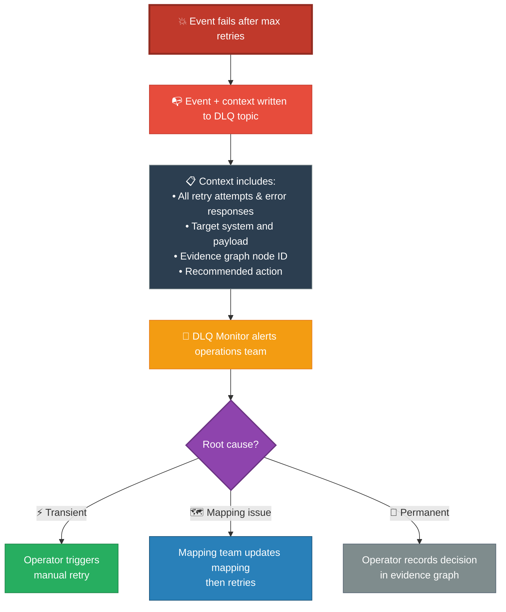
```mermaid
flowchart TB
    A["💥 Event fails after max retries"] --> B["📭 Event + context written to DLQ topic"]

    B --> CTX["📋 Context includes:<br/>• All retry attempts & error responses<br/>• Target system and payload<br/>• Evidence graph node ID<br/>• Recommended action"]

    CTX --> C["🔔 DLQ Monitor alerts operations team"]

    C --> D{"Root cause?"}

    D -->|"⚡ Transient"| E["Operator triggers<br/>manual retry"]
    D -->|"🗺️ Mapping issue"| F["Mapping team updates mapping<br/>then retries"]
    D -->|"🚫 Permanent"| G["Operator records decision<br/>in evidence graph"]

    style A fill:#c0392b,stroke:#922b21,color:#fff,stroke-width:3px
    style B fill:#e74c3c,stroke:#c0392b,color:#fff
    style CTX fill:#2c3e50,stroke:#7f8c8d,color:#fff
    style C fill:#f39c12,stroke:#e67e22,color:#fff
    style D fill:#8e44ad,stroke:#6c3483,color:#fff,stroke-width:2px
    style E fill:#27ae60,stroke:#1e8449,color:#fff
    style F fill:#2980b9,stroke:#1a5276,color:#fff
    style G fill:#7f8c8d,stroke:#566573,color:#fff
```

---

## Security & Compliance Considerations

### Data Security

| Layer | Measure | Implementation |
|---|---|---|
| **Transport** | TLS 1.3 for all inter-component and external API communication | Mutual TLS (mTLS) between internal services; standard TLS for department API calls |
| **Storage** | AES-256 encryption at rest | PostgreSQL TDE; Kafka encryption at rest; Redis encryption at rest |
| **Access Control** | Role-based access control (RBAC) with principle of least privilege | Each connector has credentials scoped to its source system only; Manual Review Console has role-based access (viewer, reviewer, admin) |
| **Credential Management** | Centralised secret management | HashiCorp Vault or Kubernetes Secrets with external secret store integration |
| **Audit** | Immutable evidence graph | All access to the evidence graph is itself logged; graph is append-only |

### PII Protection

- **No PII in logs:** Structured logging with PII fields redacted. Event IDs and UBIDs are logged; field values are not.
- **No PII to external services:** AI-assisted schema mapping uses only synthetic or scrambled data. Raw PII is never sent to any LLM or external API.
- **Data residency:** All data stored within Karnataka/India-hosted infrastructure.
- **Retention policies:** Event data retention follows government data retention guidelines. Evidence graph is retained indefinitely for legal audit.

### Compliance

| Requirement | UBID Fabric Compliance |
|---|---|
| **IT Act 2000 (India)** | All data handling follows IT Act provisions for electronic records; evidence graph provides legally admissible audit trail |
| **Personal Data Protection** | PII is never transmitted externally; access controlled via RBAC; data processed only for stated synchronisation purpose |
| **Right to Information (RTI)** | Evidence graph enables efficient response to RTI queries about data processing decisions |
| **Government audit requirements** | Evidence graph provides legal-grade audit trail with causal traceability |

---

## AI Usage (Strictly Controlled)

### AI Usage Policy

UBID Fabric uses AI in exactly two places, both offline and both with strict controls:

### Use Case 1: Schema Mapping Suggestion

**When:** Onboarding a new department system.

**What:** When a new department system is onboarded, Claude (or equivalent LLM) analyses the department's schema alongside the SWS schema and suggests initial field correspondences.

**Controls:**
- **Data:** Only synthetic or scrambled data is used. Never raw PII.
- **Offline only:** AI analysis runs during onboarding, not during real-time event processing.
- **Human approval required:** Every AI suggestion is reviewed and approved by a human domain expert before the mapping is promoted.
- **Shadow mode verification:** Even after human approval, the mapping runs in shadow mode before going live.

**Workflow:**

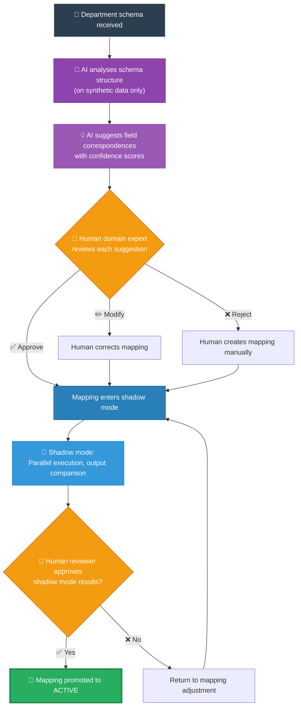
```mermaid
flowchart TB
    A["📄 Department schema received"] --> B["🤖 AI analyses schema structure<br/>(on synthetic data only)"]
    B --> C["💡 AI suggests field correspondences<br/>with confidence scores"]
    C --> D{"👤 Human domain expert<br/>reviews each suggestion"}

    D -->|"✅ Approve"| E["Mapping enters shadow mode"]
    D -->|"✏️ Modify"| F["Human corrects mapping"] --> E
    D -->|"❌ Reject"| G["Human creates mapping manually"] --> E

    E --> H["🔄 Shadow mode:<br/>Parallel execution, output comparison"]
    H --> I{"👤 Human reviewer approves<br/>shadow mode results?"}
    I -->|"✅ Yes"| J["🚀 Mapping promoted to ACTIVE"]
    I -->|"❌ No"| K["Return to mapping adjustment"] --> E

    style A fill:#2c3e50,stroke:#ecf0f1,color:#fff,stroke-width:2px
    style B fill:#8e44ad,stroke:#6c3483,color:#fff
    style C fill:#9b59b6,stroke:#8e44ad,color:#fff
    style D fill:#f39c12,stroke:#e67e22,color:#fff,stroke-width:2px
    style E fill:#2980b9,stroke:#1a5276,color:#fff
    style H fill:#3498db,stroke:#2980b9,color:#fff
    style I fill:#f39c12,stroke:#e67e22,color:#fff,stroke-width:2px
    style J fill:#27ae60,stroke:#1e8449,color:#fff,stroke-width:3px
```

### Use Case 2: Anomaly Explanation

**When:** Reconciliation engine detects drift patterns.

**What:** The reconciliation engine can use AI to generate plain-language explanations of detected drift patterns for the reviewer dashboard.

**Controls:**
- **Input:** Only aggregate statistics and field names — no actual field values or PII.
- **Output:** Natural language explanation displayed on dashboard for human review.
- **No automated action:** AI explanations are informational only. No automated decisions are made based on AI output.

### What AI Is NOT Used For

- ❌ Runtime event processing
- ❌ Conflict resolution decisions
- ❌ UBID resolution
- ❌ Propagation decisions
- ❌ Any processing involving raw PII

---

## Technology Stack (with Justification)

| Component | Technology | Justification | Alternatives Considered |
|---|---|---|---|
| **Event Streaming** | Apache Kafka | Durable, replayable, exactly-once semantics via idempotent producers. Partitioning by UBID ensures ordered processing within a business entity. Mature ecosystem with Debezium integration. | RabbitMQ (lacks replay), Pulsar (less mature ecosystem), NATS (insufficient durability) |
| **Event Store** | PostgreSQL | ACID guarantees for the immutable event log. Rich indexing (B-tree, GIN for JSONB) for audit queries. Widely understood operational model. | MongoDB (eventual consistency concerns for audit), CockroachDB (complexity overhead), Event Store DB (limited query capability) |
| **Idempotency Store** | Redis | Sub-millisecond lookup latency for event ID deduplication. Atomic SET NX operation provides race-condition-free claim semantics. | PostgreSQL (higher latency for hot-path deduplication), Memcached (no persistence for safety net) |
| **Saga Orchestration** | Temporal.io | Durable, resumable workflow execution. Built-in retry, timeout, compensation, and signal handling. Eliminates custom state machine code. Open-source with production track record (Uber, Netflix, Stripe). | Cadence (predecessor, less active), Step Functions (AWS-specific), custom state machines (high maintenance burden) |
| **CDC** | Debezium | Captures row-level changes from database transaction logs with minimal source system impact. Integrates natively with Kafka. Supports PostgreSQL, MySQL, Oracle. | Maxwell (MySQL only), pg_logical (PostgreSQL only), custom triggers (invasive) |
| **Container Orchestration** | Kubernetes | Standard deployment platform for microservices. Provides auto-scaling, self-healing, rolling updates, and resource management. | Docker Compose (insufficient for production), ECS (AWS-specific), Nomad (smaller ecosystem) |
| **Monitoring** | Prometheus + Grafana | Industry-standard metrics collection and visualisation. Rich alerting capabilities. | Datadog (cost), ELK (different purpose), CloudWatch (AWS-specific) |
| **Secret Management** | HashiCorp Vault | Centralised credential storage with audit logging, automatic rotation, and fine-grained access control. | K8s Secrets (limited audit), AWS Secrets Manager (cloud-specific) |

---

## End-to-End Flows

### Flow 1: Address Update from SWS to Department Systems

**Trigger:** A business updates its registered address from "789 Industrial Area, Bengaluru" to "123 MG Road, Bengaluru" through the SWS portal.

**Step-by-step execution:**

| Step | Component | Action | Output |
|---|---|---|---|
| 1 | SWS Webhook Connector | Receives webhook notification from SWS. Parses payload. Extracts field change: `registered_address: "789 Industrial Area" → "123 MG Road"` | RawChange published to `topic:raw-changes` |
| 2 | Change Capture Layer | Validates payload against SWS schema v4.1. Normalises address format. No schema drift detected. | Validated payload |
| 3 | Canonical Event Builder | Creates canonical event with deterministic event ID: `sha256("UBID-847|SWS|100|sha256(payload)")`. Assigns Lamport timestamp 100. Records mapping version v3.2.1 and policy version v2.0.0. | Canonical event published to `topic:canonical-events` |
| 4 | Immutable Event Log | Event appended to Kafka (partition by UBID-847) and PostgreSQL event store. | Event durably stored (two copies) |
| 5 | UBID Resolution Engine | Looks up UBID-KA-2024-00000847. Exact match found. Confidence score: 0.98 (HIGH_CONFIDENCE). | Resolved event published to `topic:resolved-events` |
| 6 | Conflict Convergence Engine | Checks for in-flight events targeting UBID-847.registered_address within the 30-second conflict window. None found. No conflict. | Unconflicted event published to `topic:converged-events` |
| 7a | Schema Mapping Registry | Transforms for FACTORIES: `registered_address` → `factory_address_line1` ("123 MG Road") + `factory_address_line2` ("Bengaluru") via SPLIT_ADDRESS transformation | FACTORIES payload ready |
| 7b | Schema Mapping Registry | Transforms for SHOP_ESTABLISHMENT: `registered_address` → `shop_address` ("123 MG Road, Bengaluru") via CONCATENATE transformation | SHOP_ESTABLISHMENT payload ready |
| 8 | Idempotency Store | Checks event ID in Redis. Not found. Claims event ID with SET NX. | Event claimed for processing |
| 9a | Saga Orchestrator | Step 1: Writes to FACTORIES API. `PUT /api/registrations/FAC-847 {factory_address_line1: "123 MG Road", factory_address_line2: "Bengaluru"}`. Response: 200 OK. | Step 1 complete |
| 9b | Saga Orchestrator | Step 2: Writes to SHOP_ESTABLISHMENT API. `PUT /api/shops/SE-847 {shop_address: "123 MG Road, Bengaluru"}`. Response: 200 OK. | Step 2 complete |
| 10 | Idempotency Store | Marks event ID as PROCESSED in Redis. | Idempotency record updated |
| 11 | Evidence Graph | Records: canonical event → UBID resolution → conflict check (no conflict) → schema translation (×2) → propagation write (×2) → write confirmation (×2). All nodes connected with `caused_by` edges. | Full causal chain recorded |
| 12 | Reconciliation Engine | On next scheduled run (6 hours later): queries FACTORIES and SHOP_ESTABLISHMENT APIs. Both return the expected values. Records MATCH in evidence graph. | Propagation verified |

**Total latency (webhook):** < 5 seconds from SWS update to all department writes confirmed.

**Sequence Diagram:**

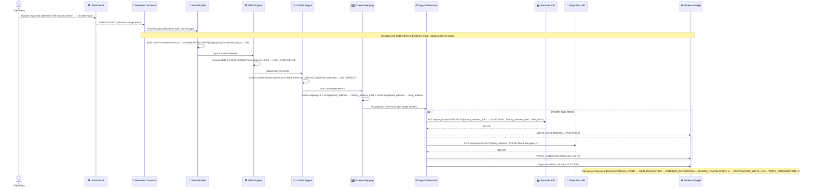
```mermaid
sequenceDiagram
    actor BIZ as 🏢 Business
    participant SWS as 🏛️ SWS Portal
    participant CONN as 🔌 Webhook Connector
    participant EVT as 📝 Event Builder
    participant UBID as 🔍 UBID Engine
    participant CCE as ⚖️ Conflict Engine
    participant MAP as 🗺️ Schema Mapping
    participant SAGA as ⚙️ Saga Orchestrator
    participant FAC as 🏭 Factories API
    participant SHOP as 🏪 Shop Estb. API
    participant EG as 📊 Evidence Graph

    BIZ->>SWS: Update registered address\n"789 Industrial Area" → "123 MG Road"
    SWS-->>CONN: Webhook POST (address change event)
    CONN->>EVT: RawChange published to topic:raw-changes
    Note over CONN,EG: All steps emit audit entries to Evidence Graph (shown once for clarity)

    EVT->>EVT: Build canonical event\nevent_id = sha256(UBID-847|SWS|100|payload_hash)\nlamport_ts = 100
    EVT->>UBID: topic:canonical-events

    UBID->>UBID: Lookup UBID-KA-2024-00000847\nConfidence = 0.98 → HIGH_CONFIDENCE
    UBID->>CCE: topic:resolved-events

    CCE->>CCE: Check conflict window (30s)\nNo in-flight events for UBID-847.registered_address\n→ NO CONFLICT
    CCE->>MAP: topic:converged-events

    MAP->>MAP: Apply mapping v3.2.1\nregistered_address → factory_address_line1 + line2\nregistered_address → shop_address
    MAP->>SAGA: Propagation commands (per target system)

    par Parallel Saga Steps
        SAGA->>FAC: PUT /api/registrations/FAC-847\n{factory_address_line1: "123 MG Road", factory_address_line2: "Bengaluru"}
        FAC-->>SAGA: 200 OK
        SAGA->>EG: WRITE_CONFIRMATION (FACTORIES)
    and
        SAGA->>SHOP: PUT /api/shops/SE-847\n{shop_address: "123 MG Road, Bengaluru"}
        SHOP-->>SAGA: 200 OK
        SAGA->>EG: WRITE_CONFIRMATION (SHOP_ESTB)
    end

    SAGA->>EG: Saga complete — all steps SUCCESS
    Note over EG: Full causal chain recorded:\nCANONICAL_EVENT → UBID_RESOLUTION → CONFLICT_DETECTION\n→ SCHEMA_TRANSLATION × 2 → PROPAGATION_WRITE × 2\n→ WRITE_CONFIRMATION × 2
```

---

### Flow 2: Signatory Update from Department System (Factories) to SWS

**Trigger:** An officer in the Factories department updates the authorised signatory from "Rajesh Kumar" to "Priya Sharma" directly in the Factories system.

**Step-by-step execution:**

| Step | Component | Action | Output |
|---|---|---|---|
| 1 | Factories CDC Connector (Debezium) | Captures row-level change from Factories database WAL: `signatory_name: "Rajesh Kumar" → "Priya Sharma"` | RawChange published to `topic:raw-changes` |
| 2 | Change Capture Layer | Validates against Factories schema v2.3. Field type: STRING. Normalises whitespace. | Validated payload |
| 3 | Canonical Event Builder | Creates canonical event. field_changes includes `authorised_signatory` with crdt_type: `OR_SET` (SWS stores signatories as a set). Lamport timestamp: 201. | Canonical event evt-042 |
| 4 | Immutable Event Log | Event stored durably. | Event persisted |
| 5 | UBID Resolution Engine | Resolves UBID from Factories entity ID. Cross-references with UBID registry. Confidence: 0.96 (HIGH_CONFIDENCE). | Resolved event |
| 6 | Conflict Convergence Engine | No in-flight SWS update for the same UBID and field. No conflict. | Unconflicted event |
| 7 | Schema Mapping Registry | Transforms for SWS: `signatory_name` (string in Factories) → `authorised_signatories` (set in SWS). Transformation: ADD("Priya Sharma") to the signatory set. Note: the mapping must also determine if "Rajesh Kumar" should be removed. In this case, the source system's semantics indicate a replacement, so a REMOVE("Rajesh Kumar") is also emitted for the OR-Set. | SWS payload ready: OR-Set operations [ADD("Priya Sharma"), REMOVE("Rajesh Kumar")] |
| 8 | Idempotency Store | Event ID claimed. | Processing proceeds |
| 9 | Saga Orchestrator | Writes to SWS API: `PATCH /api/registrations/UBID-847/signatories {add: ["Priya Sharma"], remove: ["Rajesh Kumar"]}`. Response: 200 OK. | Write confirmed |
| 10 | Evidence Graph | Full chain recorded: CDC capture → event → resolution → no conflict → mapping → write → confirmation. | Audit trail complete |

---

### Flow 3: Conflict Scenario — Simultaneous Address Updates

**Trigger:** At 10:04:23 AM, a business updates its address to "123 MG Road" through SWS. At 10:04:25 AM (2 seconds later), an officer in Shop Establishment corrects the same address to "456 Brigade Road" based on a field verification.

**Step-by-step execution:**

| Step | Component | Action | Output |
|---|---|---|---|
| 1a | SWS Webhook Connector | Captures SWS change. Lamport timestamp: 300. | Event evt-A for UBID-847.registered_address |
| 1b | Shop Est. Polling Connector | Captures Shop Establishment change on next poll (5 seconds later). Lamport timestamp: 301. | Event evt-B for UBID-847.registered_address |
| 2 | Canonical Event Builder | Both events created with deterministic event IDs. | Both events in event log |
| 3 | UBID Resolution | Both resolve to UBID-847 with HIGH_CONFIDENCE. | Both events proceed |
| 4 | Conflict Convergence Engine | evt-B arrives while evt-A is still within the 30-second conflict window. **Conflict detected**: two events on UBID-847.registered_address within conflict window. | Conflict node created in evidence graph |
| 5 | **Level 1 — CRDT Resolution** | Field type: registered_address → STRING → LWW_REGISTER. Compare Lamport timestamps: evt-A (300) vs. evt-B (301). evt-B has higher Lamport timestamp → **evt-B wins by CRDT rule**. | CRDT resolution: "456 Brigade Road" wins |
| 6 | **Level 2 — Source Priority Check** | However, source priority policy states: for `registered_address`, SWS is authoritative (priority 1) and Shop Establishment is priority 3. **Source priority overrides CRDT** because the policy is configured to override LWW for registration fields (this is a design choice — some deployments may allow CRDT to be final). | **Source priority override: "123 MG Road" wins** |
| 7 | Evidence Graph | Conflict node records: evt-A and evt-B as competing events. Resolution: Level 2 (Source Priority). Winning value: "123 MG Road" (SWS). Losing value: "456 Brigade Road" (Shop Est.). Policy version: v2.0.0. Override reason: SWS is authoritative for registration fields. | Full conflict resolution audit trail |
| 8 | Saga Orchestrator | Propagates SWS value ("123 MG Road") to all department systems, including Shop Establishment (overwriting the officer's correction). | "123 MG Road" is now the value in all systems |
| 9 | Manual Review Console | The officer's value was overridden. An **informational notification** is sent to the Shop Establishment dashboard: "Your update to registered_address for UBID-847 was superseded by an SWS update. If you believe the SWS value is incorrect, please file a correction request." | Officer notified |

**Key insight:** This scenario involves a tension between CRDT determinism and domain authority. The four-level ladder allows the system to apply mathematical correctness first and then overlay governance policies. The evidence graph records exactly which rule was applied and why, enabling any future reviewer to understand and potentially override the decision.

---

### Flow 4: UBID Mismatch — Correction, Compensation, and Replay

**Trigger:** A change is detected in the Labour system for entity LAB-9923. UBID resolution matches it to UBID-KA-2024-00000847 with a confidence of 0.82 (PROBATION). The event is propagated with an unverified flag. Three days later, a manual reviewer determines that the correct UBID is UBID-KA-2024-00000923 (a different business entirely).

**Step-by-step execution:**

| Step | Component | Action | Detail |
|---|---|---|---|
| 1 | Labour Snapshot Connector | Detects field change: `employee_count: 45 → 52` for entity LAB-9923 | RawChange generated |
| 2 | UBID Resolution Engine | Fuzzy match returns UBID-847 with confidence 0.82 (name 85% similar, address 78% similar, but different registration date). State: **PROBATION**. | Event tagged with `ubid_confidence: PROBATION, ubid_verified: false` |
| 3 | Canonical Event Builder | Event evt-P created with UBID-847 and PROBATION status. Background verification task queued. | Event proceeds with caution flag |
| 4 | Conflict Engine | No conflict detected. | Event proceeds |
| 5 | Saga Orchestrator | Propagates employee_count update to SWS for UBID-847. Write includes `ubid_verified: false` internal metadata. Response: 200 OK. | SWS now shows employee_count=52 for UBID-847 (incorrect) |
| 6 | Evidence Graph | Records full chain with PROBATION flag. | Traceable audit |
| 7 | **Manual Review (3 days later)** | Background verification task reaches the reviewer queue. Reviewer examines UBID-847 and LAB-9923. Determines: LAB-9923 is actually UBID-923 (different business). Reviewer records decision with justification: "LAB-9923 registration certificate shows UBID-KA-2024-00000923, not UBID-847." | Decision recorded as MANUAL_DECISION node |
| 8 | **UBID Correction Triggered** | UBID Resolution Engine emits UBID_CORRECTION event: `original_ubid: UBID-847, corrected_ubid: UBID-923, reason: "Manual review - registration certificate verification"` | Correction node in evidence graph |
| 9 | **Compensation — Step 1** | CompensationSaga reverses the write to SWS for UBID-847: `PATCH /api/registrations/UBID-847 {employee_count: 45}` (restore original value). Response: 200 OK. | SWS UBID-847 employee_count restored to 45 |
| 10 | **Replay — Step 1** | Original event evt-P is replayed with corrected UBID-923. New event evt-P-replay created with same payload but correct UBID. | New canonical event in event log |
| 11 | **Replay — Step 2** | Standard propagation proceeds for UBID-923: employee_count=52 written to SWS. Response: 200 OK. | SWS UBID-923 employee_count set to 52 (correct) |
| 12 | Evidence Graph | Complete chain recorded: `evt-P → PROBATION → write_to_SWS(UBID-847) → manual_review → UBID_CORRECTION → compensation(restore UBID-847) → replay(evt-P-replay, UBID-923) → write_to_SWS(UBID-923)` | Full compensating audit trail |
| 13 | Reconciliation Engine | Next scheduled run verifies: UBID-847.employee_count = 45 (correct — restored). UBID-923.employee_count = 52 (correct — newly set). Both MATCH. | Compensation verified |

**Key insight:** This scenario demonstrates why identity uncertainty must be modelled explicitly. The system allowed propagation to proceed under PROBATION (reducing operational delay) while ensuring that the incorrect assignment could be fully reversed when detected. No data was permanently corrupted, and the complete decision chain is auditable.

---

## Real-World Scenarios

### Scenario A: New Business Registration Flowing to All Departments

A new business registers through SWS. The registration creates a new entity with UBID, business name, owner name, registered address, business type, and initial signatory list.

**What happens:**
1. SWS connector detects new entity creation (ENTITY_CREATE event)
2. UBID is freshly assigned — confidence is HIGH (no ambiguity for new registrations)
3. Schema Mapping Registry generates payloads for each relevant department system based on business type:
   - If business type = "Factory": FACTORIES mapping applied
   - If business type = "Shop": SHOP_ESTABLISHMENT mapping applied  
   - If any type: COMMERCIAL_TAXES mapping applied (all businesses need tax registration)
4. Saga Orchestrator creates registration in each relevant department system
5. Evidence graph records the complete creation chain across all systems
6. Reconciliation verifies creation on next scheduled run

**Edge case:** If a department system rejects the creation (e.g., missing required field that exists in SWS but was not mapped), the saga step moves to DLQ, and a schema mapping review is triggered.

### Scenario B: Bulk Update Event — Policy Change Affecting Registration Fields

The state government announces a policy change requiring all registered addresses to include PIN codes. SWS is updated with a batch process that appends PIN codes to all registered addresses.

**What happens:**
1. SWS connector detects thousands of address updates in rapid succession
2. Each update generates a canonical event
3. Conflict detection window may trigger false positives (many events for different UBIDs hitting the same field pattern). The engine correctly identifies that different UBIDs are involved — no conflicts.
4. Schema mappings transform addresses for each department system
5. Saga orchestrator processes events in parallel (different UBIDs can be processed concurrently)
6. Rate limiting prevents overwhelming department APIs — the saga orchestrator respects per-system rate limits
7. Reconciliation runs a focused scan on all modified UBIDs after the bulk update completes

**Scaling consideration:** Kafka partitioning by UBID ensures that events for different businesses are processed in parallel across multiple consumer instances, while events for the same business are processed sequentially.

### Scenario C: Department System Downtime

The Factories system goes down for scheduled maintenance for 4 hours.

**What happens:**
1. SWS updates continue to be captured and processed normally
2. Saga orchestrator attempts to write to FACTORIES — receives connection refused
3. Retry with exponential backoff: 1s, 2s, 4s, 8s, 16s — all fail
4. After 5 retries, step is moved to DLQ
5. Steps for other department systems (SHOP_ESTABLISHMENT, LABOUR, etc.) proceed normally
6. When FACTORIES comes back online:
   - DLQ consumer retries all dead-lettered events
   - Reconciliation engine runs a catch-up scan
   - Any events that arrived during downtime but were not DLQ'd (e.g., new events after the initial saga failures) are caught by reconciliation
7. Evidence graph records the downtime incident, failed attempts, DLQ entries, and eventual recovery

**Guarantee:** No events are lost. All updates are eventually propagated. The reconciliation engine is the final safety net.

### Scenario D: Schema Change in Department System Without Notice

The Factories department updates their API, changing the field name from `factory_address` to `factory_registered_address` without notifying the fabric team.

**What happens:**
1. Next propagation attempt uses the old field name → FACTORIES API returns 400 Bad Request
2. Saga orchestrator retries (in case of transient issue) → still 400
3. After max retries, step moves to DLQ with error context including the 400 response body
4. Schema drift detection alert raised: "FACTORIES API returning validation errors on previously valid payloads"
5. Fabric team investigates:
   - Discovers the field name change
   - Creates updated schema mapping (v3.3.0)
   - Deploys in shadow mode
   - Shadow mode confirms the new mapping produces valid payloads
   - Promotes mapping to ACTIVE
6. DLQ events are replayed with new mapping → FACTORIES accepts the writes
7. Reconciliation verifies all DLQ'd events were successfully propagated

**Design insight:** This is why schema mappings are versioned and shadow-mode-deployed. The system detects the problem quickly, and recovery is a mapping update — not a code change.

---

## Trade-offs & Design Decisions

### Decision 1: CRDTs vs. Operational Transformation (OT)

**Chosen:** CRDTs  
**Alternative:** Operational Transformation (as used in Google Docs)

**Rationale:** OT requires a central transformation server and a shared history of operations. In UBID Fabric, there is no central server that all systems operate through — each system has its own independent state. CRDTs are specifically designed for this topology: they guarantee convergence without coordination. The trade-off is that CRDTs support a smaller set of merge operations (LWW, OR-Set, counters) compared to OT's richer operation space, but this set covers the field types present in government business registrations.

### Decision 2: Kafka + PostgreSQL vs. Pure Event Store (e.g., EventStoreDB)

**Chosen:** Kafka (streaming) + PostgreSQL (queryable store)  
**Alternative:** EventStoreDB (unified event store)

**Rationale:** EventStoreDB provides a purpose-built event store with projection capabilities. However, it has a smaller operational community, fewer deployment tooling options, and less mature Kubernetes operator support compared to Kafka + PostgreSQL. In a government deployment context, operational familiarity and community support are critical factors. The Kafka + PostgreSQL combination is more complex (two systems to manage) but individually each is extremely well-understood and widely deployed.

### Decision 3: Temporal.io vs. Custom Saga State Machine

**Chosen:** Temporal.io  
**Alternative:** Custom-built saga state machine with Redis or PostgreSQL backing

**Rationale:** Building a custom saga state machine that handles all of retry policies, timeout management, signal handling, compensation tracking, workflow versioning, and durable execution is a multi-month engineering effort with high bug risk. Temporal provides all of this out of the box, with production-proven reliability (used at Uber, Netflix, Coinbase, Stripe). The trade-off is an additional infrastructure dependency (Temporal server), but this is offset by thousands of lines of state machine code that do not need to be written or maintained.

### Decision 4: Field-Level vs. Record-Level Change Tracking

**Chosen:** Field-level change tracking  
**Alternative:** Record-level change tracking (capture entire record on any change)

**Rationale:** Record-level tracking is simpler to implement but loses critical information. If two systems update different fields on the same record concurrently, field-level tracking can merge both changes (no conflict). Record-level tracking would treat this as a conflict requiring resolution, even though the changes are independent. Field-level tracking also enables field-specific CRDT strategies (LWW for addresses, OR-Set for signatories), which is impossible with record-level tracking.

### Decision 5: Probation State vs. Binary (Accept/Reject)

**Chosen:** Three-state model (High Confidence / Probation / Quarantine)  
**Alternative:** Binary model (Accept / Reject)

**Rationale:** A binary model would quarantine all events with less-than-perfect UBID confidence, overwhelming the manual review queue. The probation state allows the system to proceed with likely-correct UBIDs (80–94% confidence) while flagging them for background verification. This reduces manual review volume by approximately 60–70% compared to a binary model, based on the expected distribution of UBID confidence scores.

### Decision 6: Evidence Graph vs. Structured Logging

**Chosen:** Causal evidence graph (DAG)  
**Alternative:** Structured logging (ELK, Datadog)

**Rationale:** Structured logging answers "what happened at time T." It does not support causal queries ("why is this field set to this value" requires traversing multiple log entries across multiple services and manually reconstructing the causal chain). The evidence graph makes causal relationships explicit, enabling single-query traversal. The trade-off is storage and query complexity, which is acceptable given the audit requirements.

---

## Scalability & Performance Considerations

### Throughput Estimates

| Metric | Estimate | Basis |
|---|---|---|
| **Active businesses in Karnataka** | ~500,000 | Government registration data |
| **Average updates per business per month** | 2–3 | Address changes, signatory updates, licence renewals |
| **Total events per month** | ~1.5 million | 500K × 3 |
| **Peak events per hour** | ~50,000 | End-of-quarter filing deadlines |
| **Events per second (peak)** | ~14 | 50,000 / 3,600 |
| **Events per second (sustained)** | ~0.6 | 1.5M / 30 / 24 / 3,600 |

### Scaling Strategy

**Kafka:**
- Partition count: At least 12 partitions per topic (allows 12 parallel consumers)
- Consumer groups: One consumer group per layer, enabling independent scaling
- At 14 events/second peak load, a single Kafka cluster is more than sufficient (Kafka handles millions of events/second)

**PostgreSQL:**
- Event store: Partitioned by month for efficient archival
- Evidence graph: Indexed by UBID, event_id, and timestamp
- At 1.5M events/month, PostgreSQL handles this comfortably without sharding

**Temporal:**
- Worker pool: 4–8 workers sufficient for saga execution at this throughput
- Workflow history size: Each saga produces 3–5 history events (well within Temporal's limits)

**Redis:**
- Memory requirement: ~100 bytes per idempotency entry × 7 days retention × 14/sec peak = ~85 MB
- Single Redis instance is more than sufficient

### Latency Targets

| Path | Target | Achieved By |
|---|---|---|
| Webhook → canonical event | < 500ms | In-process event builder; Kafka producer with low latency config |
| Canonical event → conflict resolved | < 1 second | In-memory conflict window; CRDT merge is O(1) |
| Conflict resolved → propagation complete | < 5 seconds | Parallel saga steps; HTTP connection pooling |
| End-to-end (Tier 1 system) | < 10 seconds | All above |
| End-to-end (Tier 3 system) | < 20 minutes | Snapshot interval + processing pipeline |

---

## Deployment Strategy

### Environment Topology

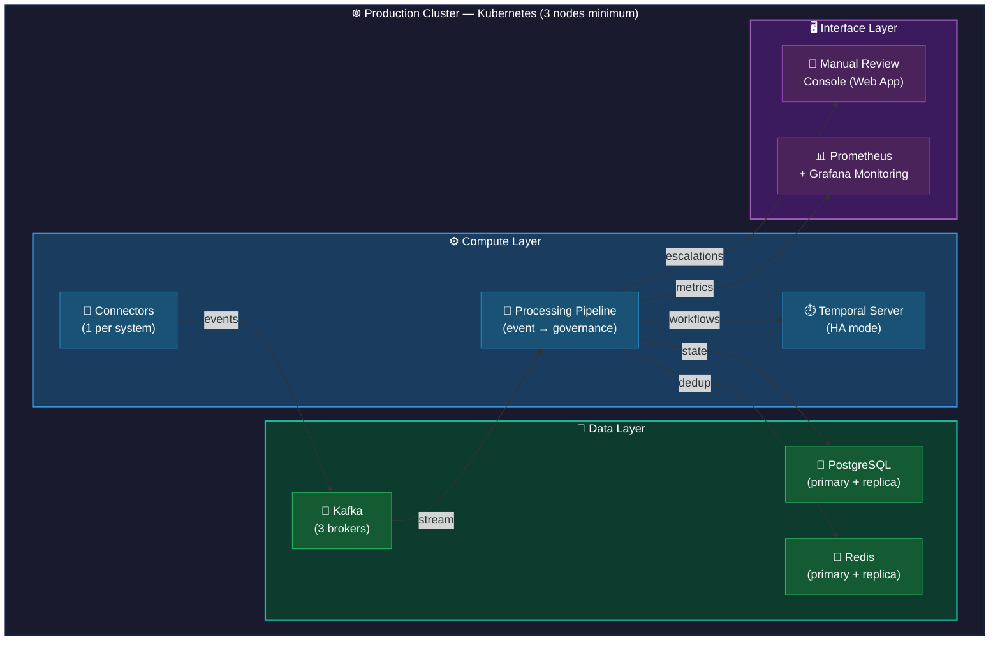
```mermaid
graph TB
    subgraph K8S["☸️ Production Cluster — Kubernetes (3 nodes minimum)"]
        subgraph DATA["💾 Data Layer"]
            KAFKA["📨 Kafka<br/>(3 brokers)"]
            PG["🐘 PostgreSQL<br/>(primary + replica)"]
            REDIS["🔑 Redis<br/>(primary + replica)"]
        end

        subgraph COMPUTE["⚙️ Compute Layer"]
            TEMPORAL["⏱️ Temporal Server<br/>(HA mode)"]
            CONN["🔌 Connectors<br/>(1 per system)"]
            PIPE["🔄 Processing Pipeline<br/>(event → governance)"]
        end

        subgraph UI["🖥️ Interface Layer"]
            MRC["👤 Manual Review<br/>Console (Web App)"]
            MON["📊 Prometheus<br/>+ Grafana Monitoring"]
        end
    end

    CONN -->|events| KAFKA
    KAFKA -->|stream| PIPE
    PIPE -->|state| PG
    PIPE -->|dedup| REDIS
    PIPE -->|workflows| TEMPORAL
    PIPE -->|metrics| MON
    PIPE -->|escalations| MRC

    style K8S fill:#1a1a2e,stroke:#16213e,color:#fff,stroke-width:3px
    style DATA fill:#0d3b2e,stroke:#1abc9c,color:#fff,stroke-width:2px
    style COMPUTE fill:#1a3c5e,stroke:#3498db,color:#fff,stroke-width:2px
    style UI fill:#3c1a5e,stroke:#9b59b6,color:#fff,stroke-width:2px
    style KAFKA fill:#145a32,stroke:#27ae60,color:#fff
    style PG fill:#145a32,stroke:#27ae60,color:#fff
    style REDIS fill:#145a32,stroke:#27ae60,color:#fff
    style TEMPORAL fill:#1a5276,stroke:#2980b9,color:#fff
    style CONN fill:#1a5276,stroke:#2980b9,color:#fff
    style PIPE fill:#1a5276,stroke:#2980b9,color:#fff
    style MRC fill:#4a235a,stroke:#8e44ad,color:#fff
    style MON fill:#4a235a,stroke:#8e44ad,color:#fff
```

### Deployment Phases

**Phase 1: Infrastructure Setup (Day 1–3)**
- Deploy Kubernetes cluster
- Deploy Kafka, PostgreSQL, Redis, Temporal
- Configure monitoring (Prometheus, Grafana)
- Set up CI/CD pipeline

**Phase 2: Connector Deployment (Day 4–7)**
- Deploy SWS connector (Tier 1 — webhook)
- Deploy first department connector (e.g., Factories — Tier 2 — CDC)
- Validate end-to-end event flow in staging

**Phase 3: Pipeline Deployment (Day 8–14)**
- Deploy event processing pipeline
- Deploy conflict convergence engine with CRDT rules
- Deploy saga orchestrator
- Deploy idempotency store

**Phase 4: Governance Deployment (Day 15–21)**
- Deploy evidence graph audit store
- Deploy reconciliation engine
- Deploy Manual Review Console

**Phase 5: Progressive Onboarding (Day 22+)**
- Onboard department systems one at a time
- Each new system: connector + schema mapping + shadow mode + promotion
- Monitor and tune per-system configuration

---

## Implementation Plan (Phases/Weeks)

### Week 1: Event Backbone + First Connectors

| Day | Deliverable |
|---|---|
| 1–2 | Kafka cluster deployed and configured (3 brokers, topic topology defined) |
| 2–3 | PostgreSQL event store schema deployed; partitioning configured |
| 3–4 | Redis idempotency store deployed |
| 4–5 | SWS webhook connector implemented and tested against SWS staging API |
| 5 | Canonical Event Builder implemented; first events flowing through Kafka |

**Exit criteria:** Raw changes from SWS are captured, converted to canonical events, and stored in both Kafka and PostgreSQL.

### Week 2: Schema Mapping + Propagation Pipeline

| Day | Deliverable |
|---|---|
| 1–2 | Schema Mapping Registry implemented with version management |
| 2–3 | First schema mapping (SWS ↔ Factories) created and validated |
| 3–4 | Temporal.io deployed; PropagationSaga implemented |
| 4–5 | Idempotency layer implemented and tested (duplicate rejection verified) |
| 5 | End-to-end flow: SWS change → canonical event → mapping → saga → Factories write |

**Exit criteria:** A change made in SWS is automatically propagated to the Factories system with correct field mapping.

### Week 3: Conflict Engine + Audit

| Day | Deliverable |
|---|---|
| 1–2 | Conflict Convergence Engine: CRDT rules (LWW, OR-Set, monotonic merge) implemented |
| 2–3 | Source priority and domain ownership policy engine implemented |
| 3–4 | Evidence Graph Audit Store: node/edge schema, insertion pipeline, basic queries |
| 4–5 | UBID Resolution Engine: three-state model, confidence scoring, compensation workflow |
| 5 | Manual Review Console: basic web UI for quarantine and conflict review |

**Exit criteria:** Concurrent conflicting updates are resolved deterministically. UBID uncertainty is handled with probation/quarantine. All decisions are recorded in the evidence graph.

### Week 4: Reconciliation + Demo

| Day | Deliverable |
|---|---|
| 1–2 | Reconciliation Engine: expected state derivation, actual state query, diff, auto-repair |
| 2–3 | Second department connector (e.g., Shop Establishment — polling connector) |
| 3–4 | Compensation and replay workflow: end-to-end test with UBID correction scenario |
| 4–5 | Dashboard: operational metrics (event throughput, conflict rate, DLQ depth, reconciliation status) |
| 5 | Full demo: all four end-to-end scenarios demonstrated live |

**Exit criteria:** System handles all four scenarios (address update, signatory update, conflict resolution, UBID correction) with full audit trail and reconciliation verification.

---

## Risks & Mitigations

| # | Risk | Probability | Impact | Mitigation |
|---|---|---|---|---|
| R1 | **Department API unavailability** | High | Medium | Saga retry + DLQ + reconciliation catch-up. System degrades gracefully — other departments continue to receive updates. |
| R2 | **Schema changes without notice** | High | Medium | Schema drift detection flags changes immediately. Shadow mode deployment prevents mapping errors from reaching production. |
| R3 | **UBID resolution errors** | Medium | High | Three-state confidence model with probation and quarantine. Compensation workflow reverses incorrect propagations. |
| R4 | **Kafka cluster failure** | Low | Critical | 3-broker replication (can survive 1 broker failure). Connectors buffer events locally during brief outages. |
| R5 | **Performance degradation under load** | Low | Medium | Kafka partitioning enables horizontal scaling. Per-system rate limiting prevents API overload. Circuit breakers protect against cascading failures. |
| R6 | **Manual review queue overflow** | Medium | Medium | Probation state reduces quarantine volume by 60–70%. Auto-escalation timeout: reviews not completed within 48 hours are automatically routed to supervisors. |
| R7 | **Data integrity incident** | Low | Critical | Evidence graph provides complete trace for root cause analysis. Compensation workflow enables full reversal. Reconciliation engine detects and repairs silent failures. |
| R8 | **Political resistance from departments** | Medium | High | System is non-invasive — no changes to department systems. Informational notifications (not overrides) for superseded updates. Domain ownership policies respect department authority over their fields. |
| R9 | **Operational complexity** | Medium | Medium | Monitoring dashboards provide real-time visibility. Runbooks for common failure scenarios. Progressive onboarding reduces day-one complexity. |
| R10 | **Connector maintenance burden** | Medium | Low | Uniform connector interface reduces per-connector complexity. Connector templates for each tier reduce new connector development time. |

---

## Why This Solution Wins

### The Three-Way Trade-off

Most interoperability solutions face a fundamental three-way trade-off:

```mermaid
graph TB
    COR["🎯 Correctness\n─────────────────────\nCRDT-guaranteed convergence\nDeterministic, provably correct\nunder all processing orders"]
    OPS["🔧 Operational Maturity\n─────────────────────\nEvidence graph audit\nReconciliation engine\nFull observability + alerts"]
    DEP["🚀 Practical Deployability\n─────────────────────\nZero source system modification\nAll tiers supported (Webhook → Snapshot)\nIncremental onboarding"]

    WIN["✅ UBID Fabric\n──────────────────────\nDelivers ALL THREE simultaneously"]

    COR --- WIN
    OPS --- WIN
    DEP --- WIN

    ESB["ESB\n✅ Maturity\n✅ Deploy\n❌ Correct"]
    ETL["Batch ETL\n❌ Correct\n✅ Maturity\n✅ Deploy"]
    MDB["Master DB\n✅ Correct\n✅ Maturity\n❌ Deploy"]
    CUS["Custom Middleware\n✅ Correct\n❌ Maturity\n❌ Deploy"]

    ESB -.-|"picks 2"| COR
    ETL -.-|"picks 2"| COR
    MDB -.-|"picks 2"| DEP
    CUS -.-|"picks 2"| OPS

    style COR fill:#1a5276,stroke:#2980b9,color:#fff,stroke-width:3px
    style OPS fill:#145a32,stroke:#27ae60,color:#fff,stroke-width:3px
    style DEP fill:#4a235a,stroke:#8e44ad,color:#fff,stroke-width:3px
    style WIN fill:#1a3c1a,stroke:#2ecc71,color:#2ecc71,stroke-width:4px
    style ESB fill:#3d1a00,stroke:#e67e22,color:#e67e22
    style ETL fill:#3d1a00,stroke:#e67e22,color:#e67e22
    style MDB fill:#3d1a00,stroke:#e67e22,color:#e67e22
    style CUS fill:#3d1a00,stroke:#e67e22,color:#e67e22
```

**Most solutions pick two:**

| Solution Type | Correctness | Maturity | Deployability |
|---|---|---|---|
| **ESB** | ❌ No convergence guarantee | ✅ Operational tooling | ✅ Standard deployment |
| **Custom Middleware** | ✅ Can be built correctly | ❌ Months of stability work | ❌ Requires system modification |
| **Batch ETL** | ❌ Hours of inconsistency | ✅ Simple operations | ✅ Non-invasive |
| **Master Database** | ✅ Single source of truth | ✅ Standard operations | ❌ Requires all systems to change |

**UBID Fabric delivers all three:**

| Dimension | UBID Fabric | How |
|---|---|---|
| **Correctness** | ✅ CRDT-guaranteed deterministic convergence | Concurrent updates always resolve to the same final state, provably, regardless of processing order |
| **Operational Maturity** | ✅ Evidence graph + reconciliation + monitoring | Every decision is traceable. Drift is detected and repaired. Operations team has full visibility. |
| **Deployability** | ✅ Zero modification to any source system | Works with every system regardless of event capability. New departments added via configuration alone. |

### Unique Technical Differentiators

1. **CRDT-based convergence** (not timestamp-based LWW): Mathematically guarantees consistency, not just "usually works"
2. **Evidence graph audit** (not flat logs): Answers "why" and "what if", not just "what happened"
3. **Three-state UBID model** (not binary accept/reject): Handles reality where identity is imperfect
4. **Shadow mode mapping deployment** (not direct deployment): Prevents mapping errors from reaching production
5. **Compensation and replay** (not just forward propagation): Full reversibility when errors are detected

---

## Final Positioning Statement

> **UBID Fabric is a deterministic interoperability layer that combines event sourcing, CRDT-based convergence, and governance-driven control to ensure that data across Karnataka's Single Window System and 40+ department systems remains consistent, auditable, and correct under all conditions — without modifying any source system.**

It is the only solution in this space that delivers:

- **Mathematical correctness** — concurrent updates always converge, provably
- **Operational maturity** — every decision is traceable, every drift is detected, every error is reversible
- **Practical deployability** — zero modifications to any system, incremental onboarding, works with every system tier from modern webhooks to fully opaque legacy

---

*Document Version: 1.0 | Last Updated: April 2026 | Classification: Technical Architecture Submission*
